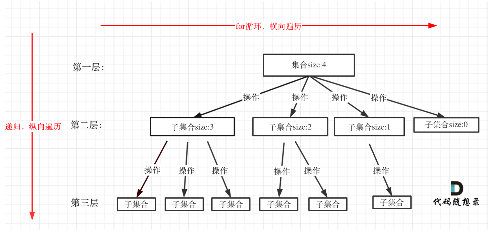

## 方法论

### 回溯算法

本质是穷举，可以加上剪枝减少消耗。

从顶部到底部，从左到右，构造树形结构，集合的大小构成树的宽度、递归的深度。

回溯三部曲（返回值及参数、终止条件、遍历过程）




```c++
void backtracking(参数) {
 if (终⽌条件) {
 存放结果;
 return;
 }
 for (选择：本层集合中元素（树中节点孩⼦的数量就是集合的⼤⼩）) {
 处理节点;
 backtracking(路径，选择列表); // 递归
 回溯，撤销处理结果
 }
}
```

#### 设计链表

```javascript
var MyLinkedList = function() {
    this.size = 0;
    this.head = new ListNode(0);
};

/** 
 * @param {number} index
 * @return {number}
 */
MyLinkedList.prototype.get = function(index) {
    if(index < 0 || index >= this.size){
        return -1
    }
    let current = this.head.next;
    for(let i = 0; i < index;i++){
        current = current.next;
    }
    return current.val;
};

/** 
 * @param {number} val
 * @return {void}
 */
MyLinkedList.prototype.addAtHead = function(val) {
    let addHead = new ListNode(val);
    
    addHead.next = this.head.next;
    this.head.next = addHead;
    this.size ++;
};

/** 
 * @param {number} val
 * @return {void}
 */
MyLinkedList.prototype.addAtTail = function(val) {
    let addTail = new ListNode(val);
    let current = this.head;
    while(current.next != null){
        current = current.next;
    }
    current.next = addTail;
    this.size ++; 
};

/** 
 * @param {number} index 
 * @param {number} val
 * @return {void}
 */
MyLinkedList.prototype.addAtIndex = function(index, val) {
    if(index < 0 || index > this.size){
        return ;
    }
    let newListNode = new ListNode(val);
    let current = this.head;
    for(let i = 0; i < index; i++){
        current = current.next;
    }
    newListNode.next = current.next;
    current.next = newListNode;
    this.size++;
};

/** 
 * @param {number} index
 * @return {void}
 */
MyLinkedList.prototype.deleteAtIndex = function(index) {
    if (index < 0 || index >= this.size) return;
    let prev = this.head;
    while (index--) prev = prev.next;
    prev.next = prev.next.next;
    this.size--;
};

/** 
 * Your MyLinkedList object will be instantiated and called as such:
 * var obj = new MyLinkedList()
 * var param_1 = obj.get(index)
 * obj.addAtHead(val)
 * obj.addAtTail(val)
 * obj.addAtIndex(index,val)
 * obj.deleteAtIndex(index)
 */
```


> [!note] 注意
> 1. 构造函数的初始化写法
> 2. head是头节点还是哑节点
> 3. 注意检测index的边界
> 4. index >= this.size 还是 index > this.size ？


#### 翻转链表

```javascript
/**
 * Definition for singly-linked list.
 * function ListNode(val, next) {
 *     this.val = (val===undefined ? 0 : val)
 *     this.next = (next===undefined ? null : next)
 * }
 */
/**
 * @param {ListNode} head
 * @return {ListNode}
 */
var reverseList = function(head) {
    let prev = null;
    let current = head;
    while(current!=null){
        let temp = current.next;
        current.next = prev;
        prev = current;
        current = temp;
    }
    return prev;
};
```

> [!note] 注意
> 1. 共用到了三个指针
> 2. 注意返回值是哪个


```javascript
/**
 * @param {ListNode} head
 * @return {ListNode}
 */
var swapPairs = function (head) {
  let ret = new ListNode(0, head), temp = ret;
  while (temp.next && temp.next.next) {
    let cur = temp.next.next, pre = temp.next;
    pre.next = cur.next;
    cur.next = pre;
    temp.next = cur;
    temp = pre;
  }
  return ret.next;
};
```

> [!note] 注意
> 1. 为什么初始temp需要是哑节点？


#### 删除链表倒数第n个节点

```javascript
/**
 * Definition for singly-linked list.
 * function ListNode(val, next) {
 *     this.val = (val===undefined ? 0 : val)
 *     this.next = (next===undefined ? null : next)
 * }
 */

var lengthList = function(head){
    let length = 0;
    while(head != null){
        head = head.next;
        length ++;
    }
    return length;
}

/**
 * @param {ListNode} head
 * @param {number} n
 * @return {ListNode}
 */
var removeNthFromEnd = function(head, n) {
    let length = lengthList(head);
    length = length - n;
    let dummy = new ListNode();
    dummy.next = head;
    let prev = dummy;
    while(length--){
        prev = prev.next;
    }
    prev.next = prev.next.next;
    return dummy.next;
};
```

> [!NOTE]
> 注意删除的位置下标

#### 链表相交

```javascript
/**
 * Definition for singly-linked list.
 * function ListNode(val) {
 *     this.val = val;
 *     this.next = null;
 * }
 */

var lengthList = function(head){
    let length = 0;
    while(head != null){
        head = head.next
        length++;
    }
    return length;
}

/**
 * @param {ListNode} headA
 * @param {ListNode} headB
 * @return {ListNode}
 */
var getIntersectionNode = function(headA, headB) {
    let lengthHeadA = lengthList(headA);
    let lengthHeadB = lengthList(headB);
    let dummyA = new ListNode(0,headA);
    let dummyB = new ListNode(0,headB);
    let currentA = dummyA;
    let currentB = dummyB;
    let bigNumber = 0;
    if(lengthHeadA >= lengthHeadB){
        bigNumber = lengthHeadA - lengthHeadB;
        while(bigNumber--){
            currentA = currentA.next;
        }
    }else if(lengthHeadB > lengthHeadA){
        bigNumber = lengthHeadB - lengthHeadA;
        while(bigNumber--){
            currentB = currentB.next;
        }
    }

    while(currentA != null && currentB != null){
        if(currentA === currentB){
            return currentA
        }
        currentA = currentA.next;
        currentB = currentB.next;
    }
    return null;
};
```

> [!NOTE]
> 思考简单方法 哈希集合法？双指针法？

```javascript
var getIntersectionNode = function(headA, headB) {
    const visited = new Set();
    let temp = headA;
    while (temp !== null) {
        visited.add(temp);
        temp = temp.next;
    }
    temp = headB;
    while (temp !== null) {
        if (visited.has(temp)) {
            return temp;
        }
        temp = temp.next;
    }
    return null;
};
```

### 哈希表

#### 有效的字母异味词

```javascript
/**
 * @param {string} s
 * @param {string} t
 * @return {boolean}
 */
var isAnagram = function(s, t) {
    if(s.length != t.length){
        return false;
    }
    let hashDetect = new Map();
    for(const a of s){
        hashDetect.set(hashDetect.set(a, (hashDetect.get(a) || 0) + 1))
    }
    for(const b of t){
        if(!hashDetect.has(b) || hashDetect.get(b) === 0)
        {return false;}

        hashDetect.set(b, hashDetect.get(b) - 1);
    }
    console.log(hashDetect);
    return true;
};
```

> [!NOTE]
> 注意向表中增加数字的写法
> 为什么(cacMap.get(char)||0)要带上||，如果不带会是什么值


#### 两个数组的交集

```javascript
/**
 * @param {number[]} nums1
 * @param {number[]} nums2
 * @return {number[]}
 */
var intersection = function(nums1, nums2) {
    let hashMap1 = new Map();
    let hashMap2 = new Map();

    let resultSet = new Set();
    let result = [];
    for(const char of nums1){
        hashMap1.set(char,(hashMap1.get(char)||0)+1);
    }
    for(const char of nums2){
        if(hashMap1.has(char)){
            resultSet.add(char);
        }
    }
    //数组写法
    // for(const char of resultSet){
    //     result.push(char);
    // }
    // return result;
    
    //集合解构转数组，更方便
    return [...resultSet]
};
```

> [!NOTE]
> 将集合变为数组的简化写法 [...resultSet]

#### 快乐数

```javascript
/**
 * @param {number} n
 * @return {boolean}
 */
var isHappy = function (n) {
    let newNnumber = n;
    let oldSet = new Set();

    // 核心计算方法
    const getSum = (num) => {
        let sum = 0;
        while (num) {
            let digit = num % 10;   
            let square = digit * digit; 
            sum += square;
        
            num = Math.floor(num / 10); 
        }
        return sum;
    };
    
    while (true) {
        if (newNnumber === 1) {
            return true
        }
        if (oldSet.has(newNnumber)) {
            return false;
        }
        oldSet.add(newNnumber);
        newNnumber = getSum(newNnumber);
    }
};
```

> [!NOTE]
> 注意核心算法：将一个正整数上的每个数字相加

#### 两数之和

```javascript
/**
 * @param {number[]} nums
 * @param {number} target
 * @return {number[]}
 */
var twoSum = function(nums, target) {
    let map = new Map();
    let index= 0;
    let result = [];
    for(const num of nums){
        let targetNumber = target - num;
        if(map.has(targetNumber)){
            result.push(map.get(targetNumber),index);
            return result;
        }
        map.set(num,index);
        index++;
    }
};
```

> [!NOTE]
> 注意不能使用同一个下标，思考改用什么来存储下标

#### 赎金信

```js
/**
 * @param {string} ransomNote
 * @param {string} magazine
 * @return {boolean}
 */
var canConstruct = function(ransomNote, magazine) {
    if(ransomNote.length > magazine.length){
        return false;
    }
    let map1 = new Map();
    let map2 = new Map();
    for(const char of ransomNote){
        map1.set(char, (map1.get(char)||0)+1)
    }
    for(const char of magazine){
        map2.set(char, (map2.get(char)||0)+1)
    }
    for(const char of map1){
        let hasOrNot = map2.has(char[0]);
        if(!map2.has(char[0]) ){
            return false;
        }
        let a = (map2.get(char[0])||0);
        let b = (map1.get(char[0])||0);
        if(a < b){
            return false;
        }
    }
    return true;
};
```

> [!NOTE]
> 注意获取map的键值对的方式 char[0] char[1];

#### 四数之加Ⅱ

```js
/**
 * @param {number[]} nums1
 * @param {number[]} nums2
 * @param {number[]} nums3
 * @param {number[]} nums4
 * @return {number}
 */
var fourSumCount = function(nums1, nums2, nums3, nums4) {
    let result = 0;
    let mapA = new Map();
    let mapB = new Map();
    let count = 0;
    for(let i = 0;i < nums1.length;i++){
        for(let j = 0; j < nums2.length ; j++){
            let addNum1 = nums1[i] + nums2[j];
            mapA.set(addNum1,(mapA.get(addNum1)||0)+1);
        }
    }
    for(let i = 0;i < nums3.length; i++){
        for(let j = 0; j < nums4.length; j++){
            let addNum2 =  nums3[i]+nums4[j];
            let targetNumber = 0 - addNum2;
           if(mapA.has(targetNumber)){
                count = count + (mapA.get(targetNumber));
           }
        }
    }
    return count;
};
```

> [!NOTE]
> 四重循环可以吗？分成两组的目的是什么？

#### 三数之和

```js
/**
 * @param {number[]} nums
 * @return {number[][]}
 */
var threeSum = function (nums) {
    nums.sort((a, b) => a - b);
    let result = [];
    let map = new Map();
    if (nums.length < 3) {
        return [];
    }
    for (let i = 0; i < nums.length - 2; i++) {
        //if(map.has(nums[i])) continue;
        //if (i > 0 && nums[i] === nums[i - 1]) continue;
        let left = i + 1;
        let right = nums.length - 1;
        let targetNumber = 0 - nums[i];
        while (left < right) {
            if (nums[left] + nums[right] === targetNumber) {
                let item = [nums[i], nums[left], nums[right]]
                if (result.includes(item)) {
                    continue;
                }
                result.push(item);

                left++;

                right--;
                map.set(nums[left], left);
            }
            else if (nums[left] + nums[right] < targetNumber) {
                left++;
            }
            else if (nums[left] + nums[right] > targetNumber) {
                right--;
            }
        }
        // 去重结果数组，确保结果中没有重复的组合
        let resultSet = new Set(result.map(JSON.stringify));
        result = Array.from(resultSet).map(JSON.parse);
    }
    return result;
};
```

#### 四数之和

```js
/**
 * @param {number[]} nums
 * @param {number} target
 * @return {number[][]}
 */
var fourSum = function (nums, target) {
    let result = [];
    if (nums.length < 4) {
        return []
    }
    nums.sort((a,b)=>a-b);
    console.log(nums);
    for (let i = 0; i < nums.length - 3; i++){

        // ！！!优化！！！
        // 去重 i
        if (i > 0 && nums[i] === nums[i - 1]) continue;
        // 最小 4 数和 > target，后面更大，直接退出
        if (nums[i] + nums[i + 1] + nums[i + 2] + nums[i + 3] > target) break;
        // 最大 4 数和 < target，当前 i 太小，进入下一轮
        if (nums[i] + nums[nums.length - 3] + nums[nums.length - 2] + nums[nums.length - 1] < target) continue;

        for (let j = i+1; j < nums.length - 2; j++) {
            let left = j + 1;
            let right = nums.length - 1;
            let targetNumber = target - (nums[i] + nums[j]);
            while (left < right) {
                let sum = nums[left] + nums[right];
                if (sum === targetNumber) {
                    result.push([nums[i], nums[j], nums[left], nums[right]].sort((a,b)=>a-b))
                    console.log(i,j,left,right)
                    left++;
                    right--;
                    
                }
                else if (sum < targetNumber) {
                    left++;
                }
                else if (sum > targetNumber) {
                    right--;
                }
            }
        }
    }
    let set = new Set(result.map(JSON.stringify));
    result = Array.from(set).map(JSON.parse);
    return result;
};
```

> [!NOTE]
> 如何优化算法运行更快？


### 字符串

#### 翻转字符串

```js
/**
 * @param {character[]} s
 * @return {void} Do not return anything, modify s in-place instead.
 */
var reverseString = function(s) {
    for(let i = 0;i < s.length/2;i++){
        let temp = s[i];
        s[i] = s[s.length-1 - i];
        s[s.length-1 - i] = temp;
    }
    return s;
};
```

> [!NOTE]
> 可以直接交换字符串中的字符位置吗
> 注意双指针中右指针的边界


#### 翻转字符串Ⅱ

```js
/**
 * @param {string} s
 * @param {number} k
 * @return {string}
 */
var reverseStr = function(s, k) {
    let array = s.split('')
    let array = [...s];
    for(let i = 0; i < array.length;i = i+2*k){
        let l = i ; let r = i + k -1 > array.length-1 ?array.length-1:i+k-1
        while(l < r){
            [array[l],array[r]] = [array[r],array[l]];
            l++;
            r--;
        }
    }
    s = array.join('');
    return s;
};
```

> [!NOTE]
> 可以直接交换字符串中的字符位置吗
> 注意双指针中右指针的边界

#### 翻转字符串中的单词

```js
/**
 * @param {string} s
 * @return {string}
 */
var reverseWords = function (s) {
    s = s.trim();

    let array = s.split(" ")
    let result = " ";
    for (let i = array.length - 1; i >= 0; i--) {
        //去除空格为什么是'' 而不是' '？
        if (array[i] === '') {
            continue;
        }
        result += array[i] + " ";
    }
    result = result.trim();
    return result;
};
```

> [!NOTE]
> 为何是array[i] === ''，而不是array[i] === ' '？

#### 重复的子字符串

```js
/**
 * @param {string} s
 * @return {boolean}
 */
var repeatedSubstringPattern = function (s) {
    let str = "";
    let array = [...s];
    for (let i = 0; i < array.length; i++) {
        str += array[i];
        let number = Math.floor(array.length / str.length);
        if (s === str.repeat(number) && number!=1) {
            console.log(str,number)
            return true;
        }
    }
    return false;
};
```

> [!NOTE]
> Math.floor()和str.repeat() 用法

### 栈与队列

#### 用栈实现队列

#### 用队列实现栈

#### 有效的括号

#### 删除字符串中的所有相邻重复项

```js
/**
 * @param {string} s
 * @return {string}
 */
var removeDuplicates = function(s) {
    let inStk = [];
    for(const ch of s){
        if(ch === inStk[inStk.length-1]){
            inStk.pop();
            continue
        }
        else if(ch !== inStk[inStk.length-1]){
            inStk.push(ch);
        }
    }
    let out = "";
    for(const ch of inStk){
        out += ch;
    }
    return out;
};
```

> [!NOTE]
> Math.floor()和str.repeat() 用法

#### 逆波兰表达式求值

```js
/**
 * @param {string[]} tokens
 * @return {number}
 */
var evalRPN = function(tokens) {
    const stack = [];
    for(const token of tokens){
      if(isNaN(Number(token))){
        const n2 = stack.pop();
        const n1 = stack.pop();
        switch(token){
          case "+":
            stack.push(n1+n2);
            break;
          case "-":
            stack.push(n1-n2);
            break;
          case "*":
            stack.push(n1*n2);
            break;
          case "/":
            stack.push(n1/n2 | 0);
            break;
        }
      }
      else {
        stack.push(Number(token));
      }
    }
    return stack[0];
};
```

> [!NOTE]
> 为什么除法是 (n1/n2 | 0) ？ 符号`| 0 `的意义是什么

#### 前K个高频元素

```js
/**
 * @param {number[]} nums
 * @param {number} k
 * @return {number[]}
 */
var topKFrequent = function (nums, k) {
  const map = new Map();
  const res = [];
  //使用 map 统计元素出现频率
  for (const num of nums) {
    map.set(num, (map.get(num) || 0) + 1);
  }

  let array = [];

  for (const entry of map) {

    array.push(entry);

    if (array.length > k) {
      array.sort((a, b) =>   b[1] - a[1]);
      array.pop();   
    }
  }
  console.log(array);
  return array.map(item => item[0]); // 只取数字
};
```

> [!NOTE]
> 如何构建前K个高频数的数组

