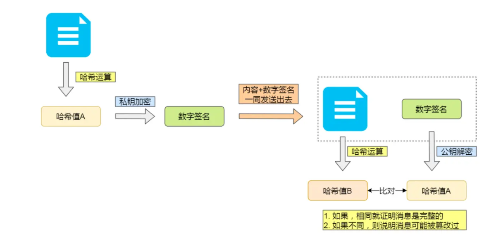
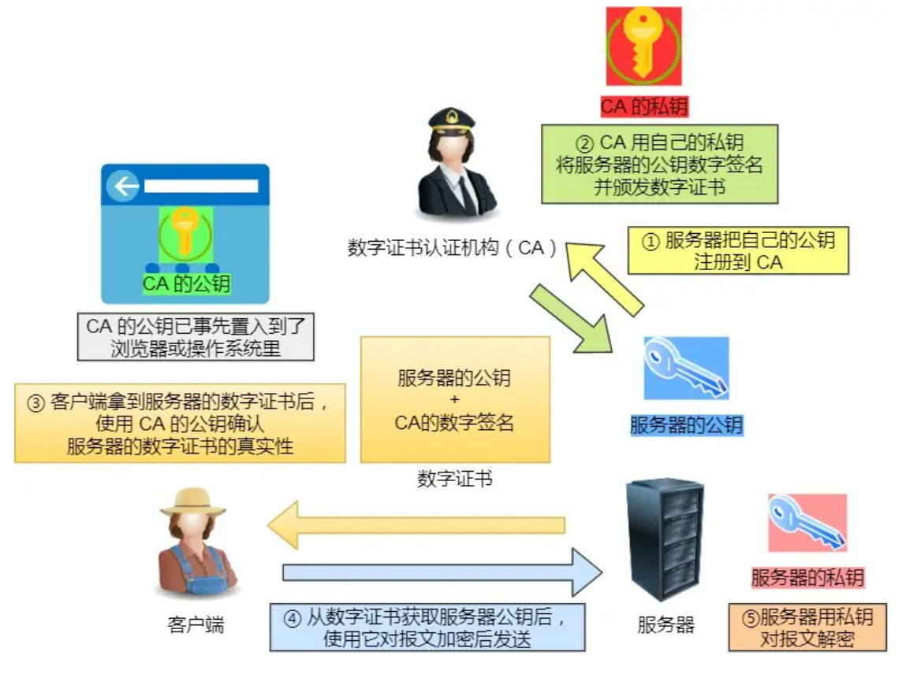
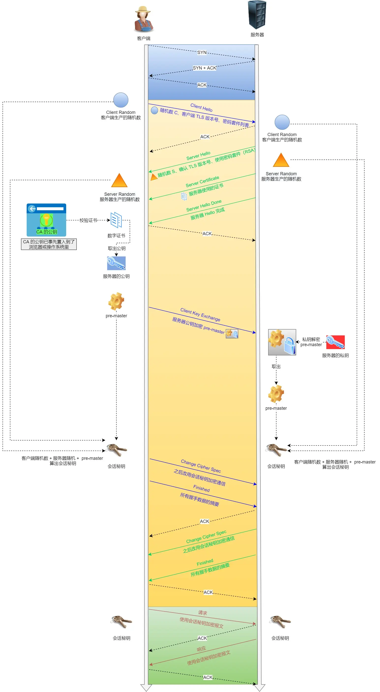
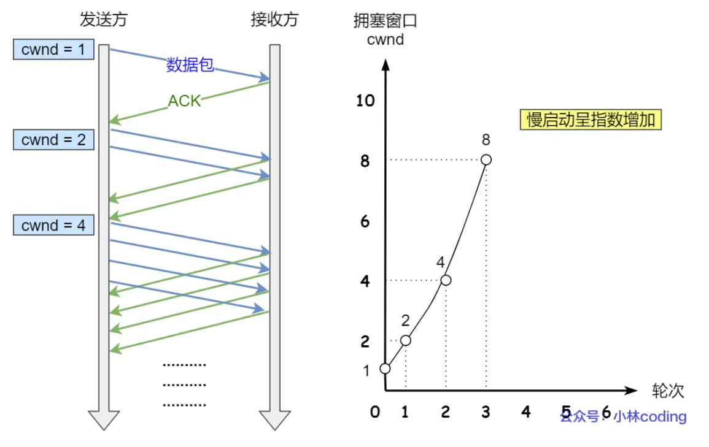
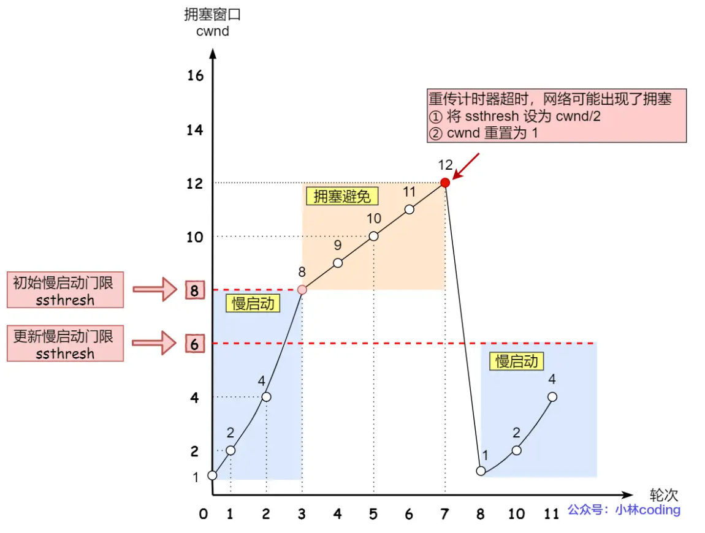
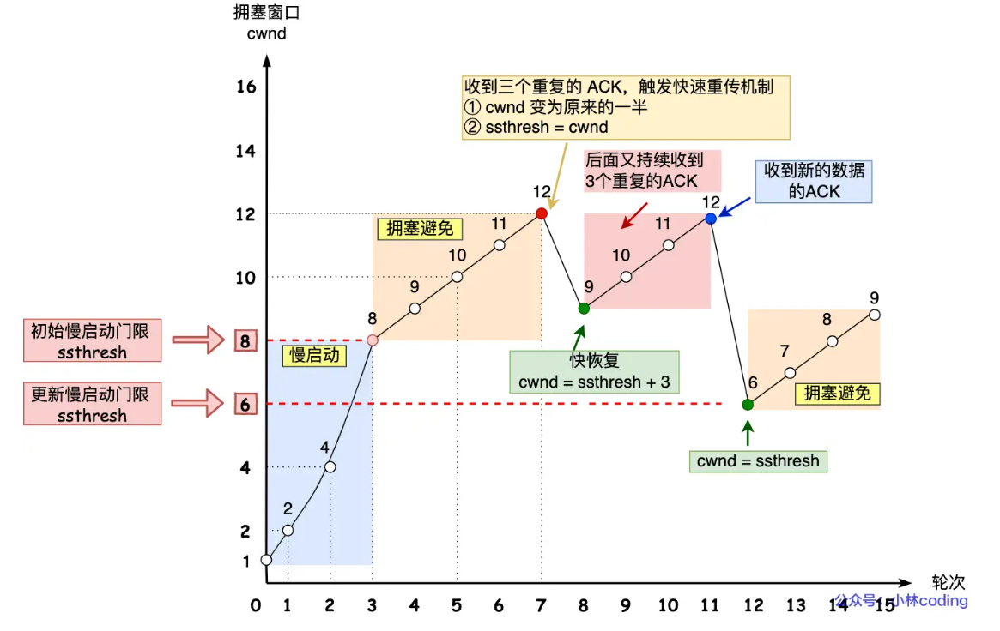

## JS

### 核心概念

1. ES6基本语法
2. ES6+
3. DOM
4. BOM
5. 作用域
6. 闭包
7. 原型链
8. 防抖和节流
9. 宏任务、微任务

       📌 一、宏任务与微任务的定义：

      JavaScript 中的异步任务分为两种：

      - **宏任务（MacroTask）**  
      - **微任务（MicroTask）**

      二者都是异步任务，区别在于执行时机不同：

      - **宏任务（Macrotask）**  
        是由浏览器或 JavaScript 宿主环境发起的任务，通常对应一次完整的事件循环（Event Loop）。

      - **微任务（Microtask）**  
        是当前任务执行完毕后立即执行的小任务，不会等到下一轮事件循环，而是在当前宏任务之后马上执行。

      ---

       🚩 二、常见示例对比：

      | 类型 | 常见示例（浏览器环境） |
      |-----------|-----------------------------|
      | **宏任务** | setTimeout、setInterval、setImmediate、I/O、UI事件（click、scroll）、ajax回调等 |
      | **微任务** | Promise.then回调、await后的代码、MutationObserver回调、queueMicrotask等 |

      ---

       🎯 二、微任务与宏任务的执行顺序

      事件循环（Event Loop）大致流程：

      ```plaintext
      执行一个宏任务 → 清空所有微任务 → 执行下一个宏任务 → 清空微任务 → ...依次循环
      ```

      换句话说：
      - 浏览器先执行一个宏任务。
      - 完成该宏任务后，立即执行**所有积累的微任务**，直到微任务队列为空。
      - 接下来再执行下一个宏任务。

      ---

       🚩 三、具体代码举例分析

      看一个典型的案例：

      ```javascript
      console.log('1'); // 同步代码

      setTimeout(() => { // 宏任务
        console.log('2');
      }, 0);

      Promise.resolve().then(() => { // 微任务
        console.log('3');
      });

      console.log('3'); // 同步代码
      ```

      输出结果顺序为：

      ```plaintext
      1
      3
      2
      ```

      - 首先执行同步代码，输出：`1`。
      - 接下来执行微任务（`Promise.then`），打印`3`。
      - 最后再执行宏任务（`setTimeout`），打印`2`。

      更清晰示例如下：

      ```javascript
      console.log('开始');

      setTimeout(() => { 
        console.log('宏任务1');
      }, 0);

      Promise.resolve().then(() => {
        console.log('微任务1');
      }).then(() => {
        console.log('微任务2');
      });

      console.log('结束');
      ```

      输出结果：

      ```
      开始
      结束
      微任务1
      微任务2
      宏任务1
      ```

      ---

       📌 四、如何区分宏任务与微任务？

      | 区别 | 宏任务(MacroTask) | 微任务(MicroTask) |
      |------|------------------|-------------------|
      | 执行时机 | 下一次事件循环中执行 | 本次任务后立即执行 |
      | 优先级 | 低（较晚） | 高（更快执行） |
      | API举例 | setTimeout、setInterval、setImmediate | Promise.then, queueMicrotask |
      | 对页面渲染影响 | 可能引起页面渲染 | 不会立即触发页面重渲染 |

      ---

       🌟 四、为什么区分宏任务和微任务？

      - 提供更细粒度的异步任务控制。
      - 微任务更快，可以帮助实现高效异步操作，如处理`Promise`状态变化。
      - 如果微任务太多，会阻塞页面渲染（注意控制数量）。

      ---

       ✅ 五、结论总结：

      - **宏任务**：相当于排队等待下一次执行的任务（如定时器）。
      - **微任务**则是每个宏任务执行结束时必须立即处理的小任务（如Promise.then），通常更快。

      通俗地记忆：

      - **微任务（Promise回调）**：是“VIP”，当前任务结束立刻执行。
      - **宏任务（setTimeout回调）**：是“普通队列”，等微任务执行完才轮到它。

10. 事件对象/事件处理/委托
11. 错误处理/异常处理
12. 内存管理
    - 内存生命周期（分配、使用、释放）
    - 内存管理机制（引用计数、标记清楚、分代回收、增量回收、并行回收）
    - 内存泄漏（意外的全局变量、未清理的定时器或回调函数、闭包、未清理的DOM引用）
13. 事件队列
14. JSON
15. Ajax/Fetch
16. 正则表达式

### js易错容混淆常考

1. == 和 ===

    ---

    | 特性         | `==`（宽松相等）               | `===`（严格相等）               |
    |--------------|-------------------------------|--------------------------------|
    | **类型转换** | 会进行类型转换                 | 不会进行类型转换               |
    | **比较规则** | 先转换类型，再比较值           | 类型不同直接返回 `false`       |
    | **使用场景** | 需要忽略类型差异时（不推荐）   | 推荐使用，避免意外类型转换     |

    ---

    使用建议
    - **优先使用 `===`**：避免因类型转换导致的意外行为，代码更安全、可读性更高。
    - **避免使用 `==`**：除非明确需要类型转换，否则容易引入难以发现的 bug。
    - 推荐始终使用 `===`，除非有特殊需求。

2. var、let、const区别

      - **var**：函数作用域，存在提升，可重复声明。

      - **let**：块级作用域，存在暂时性死区，不可重复声明。

      - **const**：块级作用域，存在暂时性死区，不可重复声明，且不能重新赋值（但可修改对象或数组的属性）。

      ```js
      console.log(x); // 输出 undefined
      var x = 10;
      console.log(x); // 输出 10
      ```

      相当于如下代码：

      ```js
      var x; // 声明被提升到顶部，初始化为 undefined
      console.log(x); // 输出 undefined
      x = 10; // 赋值
      console.log(x); // 输出 10
      ```

3. 匿名函数、箭头函数、回调函数

4. Promise, async, await

5. **this**指向问题
    JavaScript 中的 `this` 是一个特殊关键字，指向**调用函数的上下文对象**，即“谁调用了当前函数”，具体取决于函数被调用的方式、环境和场景。

    `this` 的值并不固定，会随调用方式不同而发生变化。

    ---

    一、`this`的使用场景及指向规则：

    **1. 普通函数调用：**
    - 严格模式下：`this` 为 `undefined`。
    - 非严格模式下：`this` 指向全局对象 (`window` 或 `global`)。

    ```javascript
    function test(){
      console.log(this);
    }
    test(); // window 或 global (非严格模式)
    ```

    ---

    **2. 对象方法调用：**
    - 指向调用该方法的**对象本身**。

    ```javascript
    const obj = {
      name: "Alice",
      sayName: function(){
        console.log(this.name);
      }
    };

    obj.sayName(); // Alice，this 指向 obj
    ```

    ---

    **3. 构造函数调用：**
    - 指向新创建的**实例对象**。

    ```javascript
    function Person(name){
      this.name = name; // 此时的this指向新创建的实例
    }

    const p = new Person("Bob");
    console.log(p.name); // Bob
    ```

    ---

    **4. 箭头函数中的`this`：**
    - 箭头函数**没有自己的`this`**，其 `this` 值由**外层作用域**决定。

    ```javascript
    const obj = {
      name: 'Alice',
      normalFunc: function() {
        console.log(this.name); // Alice

        const arrowFunc = () => {
          console.log(this.name); // Alice，继承了normalFunc的this
        }

        arrowFunc();
      }
    }

    obj.normalFunc();
    ```

    ---

    **5. 事件处理函数中的`this`：**
    - 指向触发事件的 DOM 元素：

    ```javascript
    const btn = document.querySelector("button");

    btn.addEventListener("click", function(){
      console.log(this); // 指向 btn
    });
    ```

    **注意**：若改用箭头函数，此时`this`指向外层作用域：

    ```javascript
    btn.addEventListener("click", () => {
      console.log(this); // 不再是按钮，通常是 window
    });
    ```

    ---

    **6. `call`、`apply`、`bind` 改变`this`的指向：**

    - 可以手动指定函数调用时的`this`：

    ```javascript
    function greet(){
      console.log(this.name);
    }

    const obj = { name: "Charlie" };

    greet.call(obj); // Charlie
    ```

    ---

     二、`this` 的指向总结表：

    | 调用方式                 | this指向对象                  |
    |-------------------------|------------------------------|
    | 普通函数调用              | window/global 或 undefined(严格模式) |
    | 对象的方法调用            | 调用方法的对象（obj）           |
    | 构造函数调用 (`new`)      | 新创建的实例对象               |
    | 箭头函数                 | 外层作用域的 this              |
    | DOM 事件处理函数（非箭头函数） | 触发事件的元素                 |
    | `call`、`apply`、`bind` | 显式指定的对象                 |

    ---

     三、如何确定 `this` 到底是谁？

    可以简单用以下原则判断：

    - 看函数**如何被调用**（而不是在哪里定义）。
    - 箭头函数时，直接看外层的`this`是谁。
    - `call`、`apply`、`bind` 强制指定的对象优先级最高。

    理解以上几点，基本就能准确掌握 JavaScript 中的 `this` 含义与指向规则。

6. call、apply、bind区别

### 常考CSS

1. 水平垂直居中的方法

2. flex布局

## STL

- vector扩容机制（如何扩容、扩容方式、移动语义、拷贝构造）
- stl中list和vector的区别？频繁插入数据用哪个？

| **操作**     | **vector**  | **list**    |
|--------------|-------------|-------------|
| **尾部插入** | O(1)        | O(1)        |
| **头部插入** | O(n)        | O(1)        |
| **中间插入** | O(n)        | O(1)        |
| **尾部删除** | O(1)        | O(1)        |
| **头部删除** | O(n)        | O(1)        |
| **中间删除** | O(n)        | O(1)        |
| **随机访问** | O(1)        | O(n)        |
| **内存使用** | 连续内存，可能导致内存搬迁 | 分散内存，无需搬迁 |

### 选择建议：
- 如果你的应用程序**频繁插入和删除数据**，并且对性能要求高，尤其是在**头部或中间插入**时，使用**list**。
- 如果你主要关心的是**高效的随机访问**，并且插入和删除主要发生在尾部，使用**vector**。


###


本质是穷举，可以加上剪枝减少消耗。

从顶部到底部，从左到右，构造树形结构，集合的大小构成树的宽度、递归的深度。

回溯三部曲（返回值及参数、终止条件、遍历过程）


## C++八股

### C++语法

1. c和c++的区别
2. 左值引用和右值引用
3. 
4. 
5. 内存对齐

### 多态与继承
1. 多态的实现（静态多态和动态多态）

2. 类的对象内存模型是什么样的？（虚函数表和虚函数指针在内存中的存储）

3. 虚函数表和虚函数指针在C++中是如何实现多态的？

4. 构造函数定义及分类

5. 析构函数可以是虚函数吗？

6. 拷贝构造函数？

7. 深拷贝和浅拷贝区别？

8.  继承、虚继承？

### 指针
9. 指针类型？
10. 指针函数、函数指针区别是什么？
11. 常量指针、指针常量、常量引用区别是什么？
12. 智能指针分类？
13. 循环引用如何出现和解决？
14. 指针和引用的区别？
15. 野指针的产生和如何避免？野指针与空指针的区别？

### 堆栈
16. **内存中堆和栈的区别是什么？**

以下是栈和堆的对比表格：

| **对比项**         | **栈**                                                                                          | **堆**                                                                                         |
|--------------------|-------------------------------------------------------------------------------------------------|------------------------------------------------------------------------------------------------|
| **内存分配方式**     | 由操作系统自动管理，遵循“先进后出”规则。                                                         | 由程序员手动管理，通过 `malloc`、`free` 或 `new`、`delete` 进行控制。                           |
| **生命周期**         | 较短，函数调用时创建，函数返回时销毁。                                                            | 由程序员控制，可以在程序运行时动态创建，直到显式调用 `free` 或 `delete`。                        |
| **存储方式**         | 存储局部变量和函数调用信息，线性结构，每个线程有自己的栈空间。                                   | 存储动态分配的对象和数组等，无顺序关系，程序员负责管理。                                       |
| **分配速度**         | 非常快，栈内存分配是顺序操作（入栈和出栈）。                                                     | 较慢，堆内存管理需要处理碎片化和内存查找等问题。                                                |
| **内存大小**         | 内存空间较小，通常由操作系统或编译器设置，有限制。                                               | 内存空间较大，受物理内存限制，通常没有操作系统限制，但管理开销较大。                            |
| **内存碎片化**       | 不会产生碎片，遵循“先进后出”规则，不会有内存块弹出。                                               | 可能发生碎片化，频繁的内存申请和释放会导致内存碎片。                                           |
| **总结**             | 自动管理、快速分配、内存有限、生命周期短、容易栈溢出。                                            | 手动管理、分配较慢、内存空间大、生命周期长、容易造成内存泄漏。                                |

17. 什么是堆、栈？
18. 什么是内存泄漏、内存溢出？
19. 内存池是什么？

- 位置：进程中的堆区域。
- 定义：预先分配的内存区域，用于管理多个小块内存的分配和释放，通过维护一个自由列表来记录未使用的内存块，实现快速内存分配和回收。
- 作用：提高内存分配效率
- 缺点：导致内存浪费、实现复杂
  
19. 什么是内存碎片？
**定义**：指内存中的可用空间被分割成许多小块，这些小块的总和虽然可能足够大，但无法满足单个大块内存分配请求的现象。
- **内部碎片**：**分配给程序的内存块中**未使用的部分，是由于内存块的大小不匹配导致的。
- **外部碎片**：**内存中**未被使用的空间被分割的小块
- **影响**：内存利用率、性能下降
- **解决方法**：内存池、定期整理、内存分配策略
  
20.  在函数中申请请堆内存需要注意什么？

- 检查申请内存是否成功：
使用动态内存分配函数（如 malloc、calloc 或 new）时，需要检查返回值是否为 NULL，以判断内存分配是否成功。

```c
int *ptr = (int *)malloc(sizeof(int) * 10);
if (ptr == NULL) {
    // 内存分配失败，处理错误
    perror("Memory allocation failed");
    exit(1);
}
```

- 及时释放内存：
每次在堆上申请的内存必须在不需要时通过 free（C语言）或 delete（C++）进行释放，避免 内存泄漏。
确保释放的内存地址是有效的，不能重复释放，也不能释放未分配的地址。

```c++
free(ptr);  // 释放内存
ptr = nullptr; // 避免悬空指针
```

- 避免悬空指针

悬空指针是指向已释放或无效内存地址的指针。在释放内存后，立即将指针置为 NULL。
```c++
free(ptr);
ptr = nullptr; // 防止悬空指针
```

- 内存对齐

- 定义：内存对齐是指数据在内存中的起始地址必须是某个固定值（对齐单位）的倍数。对齐单位通常与数据类型或架构有关。

```c++
struct MyStruct {
    int a;       // 4字节
    char b;      // 1字节
};
```

+----------------+----------------+----------------+----------------+
|       a        |       b        |     填充       |     填充       |
+----------------+----------------+----------------+----------------+
  4字节            1字节            1字节            1字节            1字节


- 内存溢出
分配的内存要足够存储需要的数据，防止 **数组越界** 或 **缓冲区溢出** 问题。
- 重复分配
多次分配同一指针前，确保已释放旧的内存。如果忘记释放旧内存而直接分配新的，会导致内存泄漏。
- 内存碎片
如果函数需要频繁分配和释放内存，可能会导致内存碎片化。可以考虑 内存池 或重用分配的内存。
- 避免空指针或无效指针操作
在释放内存或使用指针前，确保指针指向合法的地址。

21. 虚拟内存布局

+--------------------+ <- 高地址
| 内核空间           |
+--------------------+
| 栈（Stack）        | <- 栈从高地址向低地址增长
+--------------------+
| 堆（Heap）         | <- 堆从低地址向高地址增长
+--------------------+
| BSS段              |
+--------------------+
| 数据段（Data Segment） |
+--------------------+
| 代码段（Text Segment）|
+--------------------+ <- 低地址

22.  物理内存和虚拟内存如何对应
### 编译流程
1.  由源码编译到可执行文件的流程？
2.  动态链接和静态链接的区别？

### 语法层面
1.  静态成员函数和普通成员函数的区别？
2.  全局变量和局部变量的区别？
3.  #ifndef/#define/#endif的作用？
4.  C 和 C++ 中常见的变量定义方式有哪些？
5.  简单说明一下extern关键字，以及extern”C” 有什么作用？
6.  请说明一下static关键字？
7.  简单说说#include<> 和 #include""的区别是什么？
8.  简单说说什么是原码、什么是反码、什么是补码？
9.  请说说const关键字的用法？
10. 请说明struct和class并且说明他们有什么区别？
11. 什么是数组名，数组名和指针有什么区别？


### 内存
1.  简单介绍malloc如何使用？
作为C库的函数，用于申请内存，使用free释放。

```c
void* malloc(size_t size);
```

- size：需要分配的内存大小，单位是字节（byte）。通常是整数类型的字节数。
- 返回值：成功时，malloc 返回一个指向分配的内存区域的指针，类型为 void*，即一个通用指针。失败时，返回 NULL。失败的原因通常是系统内存不足或无法满足分配请求。

2.  malloc底层实现的流程？

malloc 函数分配的内存通常是从操作系统的堆（heap）中获取的。堆是程序运行时用于动态分配内存的区域。堆与栈不同，栈内存的分配和释放是由编译器自动管理的，而堆内存的分配和释放则需要程序员显式管理。

**分配策略：**
- 空闲列表：维护一个记录空闲内存块的链表。每个内存块由一个头部结构（通常包括块的大小）和数据部分组成。每当一个内存块被释放，malloc 会将其添加回空闲列表，以供后续分配。
- 分块管理：堆内存被分割成多个固定大小的块，每次 malloc 请求时，会根据请求的大小分配相应的块。如果请求的内存大小与现有块的大小不匹配，则可能会合并或拆分块。
- 页式管理：操作系统将虚拟内存分为固定大小的页面，通常为 4 KB 或更大。malloc 会向操作系统请求一页内存或更多内存，并将这些内存页分配给应用程序。当不再需要时，内存会被释放回操作系统。
- 内存池：一些 malloc 实现会维护自己的内存池。这个内存池预先分配一大块内存，并在应用程序需要内存时从这个池中提供内存。这减少了与操作系统的交互，提高了内存分配效率。

malloc分配的内存是否会归还给操作系统？
- malloc 通过 brk() 方式申请的内存，free 释放内存的时候，并不会把内存归还给操作系统，而是缓存在malloc 的内存池中，待下次使用;
- malloc 通过 mmap() 方式申请的内存，free 释放内存的时候，会把内存归还给操作系统，内存得到真正的释放。

3.  malloc和new的区别？
4.  内存分配的方式有哪些？

5.  请你简单说说数组存放在哪里？
6.  请你介绍一下c/c++中变量的作用域都有哪些？
7.  请问sizeof与strlen的区别，简单说说？
8.  简述C++有几种传值方式之间的区别？
9.  指针用的多不，请问数组指针与指针数组的区别？
10. 请问NULL和nullptr区别？

### STL
43. STL中常用的容器有哪些？
44. 请你说说STL容器有哪些并且说一下时间复杂度？
45. 请说说vector和list有什么区别？
46. vector和deque的区别？
47. 请你说明一下STL底层数据结构实现？
48. 请你说说map和set区别差异？
49. **请你说说STL迭代器怎样删除元素？**
50. **vector如何扩容？**


## 计算机网络
1. TCP和UDP的区别

- 连接类型和服务对象
- 首部
- 可靠性和传输方式
- 流量和拥塞控制
- 应用场景

| 特性             | TCP                     | UDP                     |
|------------------|-------------------------|-------------------------|
| **连接方式**         | 面向连接                | 无连接                  |
| **可靠性**           | 可靠                    | 不可靠                  |
| **数据流**           | 字节流                  | 数据报                  |
| **速度**             | 较慢                    | 较快                    |
| **流量控制**        | 有                      | 无                      |
| **拥塞控制**         | 有                      | 无                      |
| **头部开销**         | 较大（最小20字节）      | 较小（最小8字节）       |
| **错误检测**         | 完整错误检测和重传      | 基本错误检测，无重传   |
| **应用场景**         | 文件传输、网页浏览等    | 实时通信、视频流、游戏等 |


2. TCP三次握手

3. TCP四次挥手，可以变成三次吗？

4. TCP/IP模型和OSI模型

5. TCP和UDP的区别

6. TCP连接如何确保可靠性

7. UDP如何实现可靠传输

8. HTTP不同版本的区别（HTTP/1.0、HTTP/1.1、HTTP/2、HTTP/3）


| 特性/协议 | HTTP/1.0 | HTTP/1.1 | HTTP/2 | HTTP/3 |
|-----------|----------|----------|--------|--------|
| **版本号** | 1.0 | 1.1 | 2.0 | 3.0 |
| **发布年份** | 1996 | 1999 | 2015 | 2020 |
| **连接方式** | 每次请求一个连接，无复用 | 持久连接（可复用） | 多路复用（单连接多请求） | 多路复用（基于UDP的QUIC协议） |
| **请求/响应模式** | 请求-响应（阻塞） | 请求-响应（阻塞） | 二进制帧（非阻塞） | 二进制帧（非阻塞） |
| **头部压缩** | 无 | 无 | HPACK头部压缩 | HPACK头部压缩 |
| **默认加密** | 不支持 | 不支持 | 支持（推荐TLS） | 强制TLS |
| **性能优化** | 无 | 管道化（Pipeline），但存在队头阻塞 | 二进制帧、多路复用、服务器推送 | 二进制帧、多路复用、服务器推送、基于QUIC的低延迟 |
| **协议基础** | TCP | TCP | TCP | UDP（QUIC） |
| **主流浏览器支持** | 早期浏览器 | 所有现代浏览器 | 所有现代浏览器 | 所有现代浏览器（部分旧浏览器不支持） |
| **应用场景** | 简单静态网页 | 动态网页、API | 高性能Web应用、API | 高性能Web应用、API、实时应用 |

主要改进：
HTTP/1.1：
- 长连接
- 管道

HTTP/2
- 头部压缩（HPACK头部压缩）
- 二进制格式（压缩报文为头信息帧、数据帧）
- 并发传输（引入Stream概念，一个TCP含多个Stream，一个Stream含多个Message）
- 服务器主动推送资源（客户端请求HTML，服务器主动推送HTML+CSS文件）
  
HTTP/3
- 无队头阻塞（改用UDP解决HTTP/2中TCP队头阻塞问题）
- 更快的连接建立（QUIC协议）
- 连接迁移

9.  HTTP常见状态码？

- 200
- 3XX
- 4XX
  - 400
  - 401
  - 403
  - 404
  - 405
- 5XX
  - 500
  - 501
  - 502
  - 503
  - 504

10.   HTTP和HTTPS区别

| 特性             | HTTP                      | HTTPS                    |
|------------------|---------------------------|--------------------------|
| **全称**         | 超文本传输协议             | 安全超文本传输协议        |
| **加密**         | 无加密                     | 使用SSL/TLS加密协议      |
| **端口**         | 80端口                     | 443端口                  |
| **性能**         | 较快，但不安全             | 较慢，但更安全            |
| **安全性**       | 不安全，数据易被窃取      | 安全，数据加密，防篡改   |
| **验证**         | 无身份验证                 | 通过数字证书验证身份     |
| **URL格式**      | `http://`                  | `https://`               |
| **应用场景**     | 适用于不涉及敏感数据的场景 | 适用于敏感数据传输（如银行支付、电子商务） |
| **浏览器提示**   | 显示“非安全”               | 显示绿色锁标志，表示安全 |


11. HTTPS工作原理及安全体现
HTTPS在HTTP协议与TCP协议之间加入了SSL/TLS协议，解决了原有原有HTTP协议存在的窃听风险、篡改风险、冒充风险，用到的机制有信息加密、校验机制、身份证书。
- **混合加密**

**混合加密**实现机密性，**对称性加密**与**非对称性加密**结合，在通信建立前采用非对称加密的方式交换**会话秘钥**，后续就不再使用非对称加密在通信过程中全部使用对称加密的**会话秘钥**的方式加密明文数据。

- 通过**摘要算法+数字签名**实现
为了保证传输内容不被篡改，需要对内容计算出一个“指纹”，然后同内容一起传输给对方。

- **数字证书**
通过**CA**来确认双方信息是否真实



12. CA验证过程

12. TSL握手过程





13.  HTTP缓存技术？
分两种缓存方式

| **特点**         | **强制缓存（Force Cache）**                            | **协商缓存（Negotiated Cache）**                           |
|------------------|-------------------------------------------------------|-----------------------------------------------------------|
| **缓存验证**     | 浏览器不验证缓存是否过期，直接使用缓存的资源          | 浏览器会与服务器协商，判断资源是否更新                   |
| **请求频率**     | 如果缓存未过期，浏览器完全不向服务器发送请求          | 每次都会发送请求头（如 `If-Modified-Since` 或 `If-None-Match`），与服务器进行交互 |
| **过期时间**     | 由 `Cache-Control`（相对时间）和 `Expires`（绝对时间）控制缓存的过期时间 | 依赖于 `Last-Modified` 和 `ETag` 来判断资源是否更新     |
| **服务器负载**   | 如果缓存没有过期，服务器不会处理请求，减轻服务器负载   | 每次请求都会与服务器交互（即使是协商，还是需要发送请求） |
| **缓存的时效性** | 如果资源没有更新，但缓存未过期，可能会使用过时的缓存  | 即使资源过期，服务器会确保返回最新版本的资源（如果有更新） |
| **适用场景**     | 适用于不常更新的静态资源（如图片、CSS、JS文件等）    | 适用于可能更新的资源，确保客户端始终获取最新内容       |


14. 拥塞控制介绍及其实现
- 慢启动
发送方每收到一个ACK，cwnd大小就会加一。

当到达`慢启动门限`（ssthresh），就会转为使用拥塞避免算法
- 拥塞避免算法
每当收到一个 ACK 时，cwnd 增加 1/cwnd。
- 拥塞发生
拥塞会触发数据包重传，**超时重传**或**快速重传**
**超时重传**：
一旦发生超时重传，ssthresh 设为cwnd/2，cwnd重置为 1
(是恢复为 cwnd 初始化值，我这里假定 cwnd 初始化值 1)

- 快速重传与快速恢复
1.在快速恢复的过程中，首先 ssthresh=cwnd/2，然后 cwnd=ssthresh+3，表示网络可能出现了阻塞，所以需要减小 cwnd 以避免，加3代表快速重传时已经确认接收到了3个重复的数据包;
2.随后继续重传丢失的数据包，如果再收到重复的 ACK，那么 cwnd 增加 1。加1代表每个收到的重复的 ACK 包，都已经离开了网络。这个过程的目的是尽快将丢失的数据包发给目标,。3.如果收到新数据的 ACK 后，把 cwnd 设置为第一步中的 ssthresh 的值，恢复过程结束,
首先，快速恢复是拥塞发生后慢启动的优化，其首要目的仍然是降低cwnd 来减缓拥塞，所以必然会出现 cwnd 从大到小的改变。
其次，过程2(cwnd逐渐加1)的存在是为了尽快将丢失的数据包发给目标，从而解决拥塞的根本问题(三次相同的 ACK 导致的快速重传)，所以这一过程中 cwnd 反而是逐渐增大的。
如果收到新数据的 ACK 后，把 cwnd 设置为第一步中的 ssthresh 的值，原因是该 ACK 确认了新的数据，说明从 duplicated ACK 时的数据都已收到，该恢复过程已经结束，可以回到恢复之前的状态了也即再次进入拥塞避免状态;


15.  键入网址到网页显示，期间发生了什么？

- 浏览器输入网址：解析 URL，获取协议、域名等信息。
- DNS 查询：解析域名为 IP 地址。
- 建立连接：建立 TCP 连接，进行 SSL/TLS 握手（如果是 HTTPS）。
- 发送 HTTP 请求：浏览器发送请求到服务器。
- 服务器响应：服务器处理请求并返回数据。
- 浏览器渲染：浏览器解析 HTML、CSS、JavaScript，渲染页面。


## OS

1. Linux 内核 vs Windows 内核 


`连接应用和硬件设备的桥梁`

四个基本能力：

- 管理进程、线程，决定哪个进程、线程使用 CPU，也就是进程调度的能力;
- 管理内存，决定内存的分配和回收，也就是内存管理的能力;
- 管理硬件设备，为进程与硬件设备之间提供通信能力，也就是硬件通信能力；
- 提供系统调用，如果应用程序要运行更高权限运行的服务，那么就需要有系统调用，它是用户程序与操作系统之间的接口。


内核具有很高的权限，可以控制cpu、内存、硬盘等硬件，而应用程序具有的权限很小，因此大多数操作系统，把内存分成了两个区域:

- 内核空间，这个内存空间只有内核程序可以访问
- 用户空间，这个内存空间专门给应用程序使用;

用户空间的代码只能访问一个局部的内存空间，而内核空间的代码可以访问所有内存空间。因此，当程序使用用户空间时，我们常说该程序在用户态执行，而当程序使内核空间时，程序则在内核态执行。

应用程序如果需要进入内核空间，就需要通过系统调用，下面来看看系统调用的过程:


内核程序执行在内核态，用户程序执行在用户态。当应用程序使用系统调用时，会产生一个中断。发生中断后， CPU 会中断当前在执行的用户程序，转而跳转到中断处理程序，也就是开始执行内核程序。内核处理完后，主动触发中断，把 CPU 执行权限交回给用户程序，回到用户态继续工作。

```
用户态程序执行
       |
       | 调用系统调用函数（如 write）
       |
       v
触发特权指令（如 syscall）
       |
       | -> CPU 从用户态切换到内核态
       |
       v
内核处理系统调用
       |
       | -> 执行系统调用逻辑
       |
       v
内核返回用户态
       |
       | -> CPU 恢复用户态上下文
       |
       v
用户态程序继续执行

```


### 内存管理
2. 虚拟内存

我们可以把进程所使用的地址「隔离」开来，即让操作系统为每个进程分配独立的一套「虚拟地址」，人人都有，大家自己玩自己的地址就行，互不干涉。但是有个前提每个进程都不能访问物理地址，至于虚拟地址最终怎么落到物理内存里，对进程来说是透明的，操作系统已经把这些都安排的明明白白了。


> [!NOTE]
>
> 操作系统会提供一种机制，将不同进程的虚拟地址和不同内存的物理地址映射起来

如果程序要访问虚拟地址的时候，由操作系统转换成不同的物理地址，这样不同的进程运行的时候，写入的是不同的物理地址，这样就不会冲突了。
于是，这里就引出了两种地址的概念:
- 我们程序所使用的内存地址叫做虚拟内存地址(Virtual Memory Address)
- 实际存在硬件里面的空间地址叫物理内存地址(Physical Memory Address)


> [!NOTE]
>
> 操作系统引入了虚拟内存，进程持有的虚拟地址会通过CPU 芯片中的内存管理单元(MMU)的映射关系，来转换变成物理地址，然后再通过物理地址访问内存


操作系统是如何管理虚拟地址与物理地址之间的关系?
- 主要有两种方式，分别是`内存分段`和`内存分页`

3. 内存分段

程序是由若干个逻辑分段组成的，如可由代码分段、数据分段、栈段、堆段组成。不同的段是有不同的属性的，所以就用分段(Segmentation)的形式把这些段分离出来。

> [!NOTE]
>
> 分段机制下，虚拟地址和物理地址是如何映射的?

分段机制下的虚拟地址由两部分组成，**段选择因子**和**段内偏移量**


分段的办法很好，解决了程序本身不需要关心具体的物理内存地址的问题，但它也有一些不足之处:
- 内存碎片
- 内存交换效率低

4. 内存碎片 
> [!NOTE]
>
> 我们先来看看，分段为什么会产生内存碎片的问题?


内存碎片主要分为，**内部内存碎片**和**外部内存碎片**。

解决「外部内存碎片」的问题就是**内存交换**

- 可以把音乐程序占用的那 256MB 内存写到硬盘上，然后再从硬盘上读回来到内存里。不过再读回的时候，我们不能装载回原来的位置，而是紧紧跟着那已经被占用了的512MB 内存后面。这样就能空缺出连续的 256MB 空间，于是新的 200MB 程序就可以装载进来。

> [!NOTE]
>
> 再来看看，分段为什么会导致内存交换效率低的问题?

对于多进程的系统来说，用分段的方式，外部内存碎片是很容易产生的，产生了外部内存碎片，那不得不重新 swap 内存区域，这个过程会产生性能瓶颈。
因为硬盘的访问速度要比内存慢太多了，每一次内存交换，我们都需要把一大段连续的内存数据写到硬盘上。

所以，**如果内存交换的时候，交换的是一个占内存空间很大的程序，这样整个机器都会显得卡顿**。

为了解决内存分段的「外部内存碎片和内存交换效率低」的问题，就出现了**内存分页**。


5. 内存分页

分段的好处就是能产生连续的内存空间，但是会出现「外部内存碎片和内存交换的空间太大」的问题。

要解决这些问题，那么就要想出能少出现一些内存碎片的办法。另外，当需要进行内存交换的时候，让需要交换写入或者从磁盘装载的数据更少一点，这样就可以解决问题了。这个办法，也就是**内存分页(Paging)**

**分页是把整个虚拟和物理内存空间切成一段段固定尺寸的大小**。这样一个连续并且尺寸固定的内存空间我们叫页(Page)。在 Linux下，每一页的大小为 4KB

虚拟地址与物理地址之间通过页表来映射，如下图：


页表是存储在内存里的，**内存管理单元(MMU)**就做将虚拟内存地址转换成物理地址的工作。

6. 段页式内存管理


7. malloc 是如何分配内存的？
通过**brk()**和**mmap()**两种方式。

- 如果用户分配的内存小于 128 KB，则通过 brk() 申请内存
- 如果用户分配的内存大于 128 KB，则通过 mmap() 申请内存

分配的是**虚拟内存**，虚拟内存不会映射到物理内存，这样就不会占用物理内存了。3

8. new 是如何分配内存的？

> [!NOTE]
>
> for循环可以理解是横向遍历，backtracking（递归）就是纵向遍历。


### 进程管理
1. 进程与线程
2. 进程间的通信方式？如何选择？
3. 线程间的通信方式
4. 多线程冲突
5. 竞争与协作（互斥与同步）
6. 锁
7. 信号量
8. 生产者-消费者问题


分层分阶

Markdown 是一种轻量级且易于使用的语法，用于为您的写作设计风格。

### 标题

文章内容较多时，可以用标题分段：

```markdown
# 标题 1

## 标题 2

## 大标题

### 小标题
```

标题预览会打乱文章的结构，所以在此不展示。

### 粗斜体

```markdown
_斜体文本_

**粗体文本**

**_粗斜体文本_**
```

预览：

_斜体文本_

**粗体文本**

**_粗斜体文本_**

### 链接

```markdown
文字链接 [链接名称](http://链接网址)
```

预览：

文字链接 [链接名称](http://链接网址)

### 行内代码

```markdown
这是一条 `单行代码`
```

预览：

这是一条 `行内代码`

### 代码块

````markdown
```js
// calculate fibonacci
function fibonacci(n) {
  if (n <= 1) return 1
  return fibonacci(n - 1) + fibonacci(n - 2)
}
```
````

预览：

```js
// calculate fibonacci
function fibonacci(n) {
  if (n <= 1) return 1
  return fibonacci(n - 1) + fibonacci(n - 2)
}
```

当前使用 shiki 作为代码高亮插件，支持的语言请参考 [shiki / languages](https://shiki.matsu.io/languages.html)。

### 行内公式

```markdown
这是一条行内公式 $e^{i\pi} + 1 = 0$
```

预览：

这是一条行内公式 $e^{i\pi} + 1 = 0$

### 公式块

```markdown
$$
\hat{f}(\xi) = \int_{-\infty}^{\infty} f(x) e^{-2\pi i x \xi} \, dx
$$
```

预览：

$$
\hat{f}(\xi) = \int_{-\infty}^{\infty} f(x) e^{-2\pi i x \xi} \, dx
$$

当前使用 KaTeX 作为数学公式插件，支持的语法请参考 [KaTeX Supported Functions](https://katex.org/docs/supported.html)。

#### 图片

```markdown

```

预览：


#### 删除线

```markdown
~~删除线~~
```

预览：

~~删除线~~

### 列表

普通无序列表

```markdown
- 1
- 2
- 3
```

预览：

- 1
- 2
- 3

普通有序列表

```markdown
1. GPT-4
2. Claude Opus
3. LLaMa
```

预览：

1. GPT-4
2. Claude Opus
3. LLaMa

列表里可以继续嵌套语法

### 引用

```markdown
> 枪响，雷鸣，剑起。繁花血景。
```

预览：

> 枪响，雷鸣，剑起。繁花血景。

引用里也可以继续嵌套语法。

### 换行

markdown 分段落是需要空一行的。

```markdown
如果不空行
就会在一段

第一段

第二段
```

预览：

如果不空行
就会在一段

第一段

第二段

### 分隔符

如果你有写分割线的习惯，可以新起一行输入三个减号`---` 或者星号 `***`。当前后都有段落时，请空出一行：

```markdown
---
```

预览：

---

## 高级技巧

### 行内 HTML 元素

目前只支持部分段内 HTML 元素效果，包括 `<kdb> <b> <i> <em> <sup> <sub> <br>` ，如

#### 键位显示

```markdown
使用 <kbd>Ctrl</kbd> + <kbd>Alt</kbd> + <kbd>Del</kbd> 重启电脑
```

预览：

使用 <kbd>Ctrl</kbd> + <kbd>Alt</kbd> + <kbd>Del</kbd> 重启电脑

#### 粗斜体

```markdown
<b> Markdown 在此处同样适用，如 _加粗_ </b>
```

预览：

<b> Markdown 在此处同样适用，如 _加粗_ </b>

### 其他 HTML 写法

#### 折叠块

```markdown
<details><summary>点击展开</summary>它被隐藏了</details>
```

预览：

<details><summary>点击展开</summary>它被隐藏了</details>

### 表格

```markdown
| 表头1 | 表头2 |
| ----- | ----- |
| 内容1 | 内容2 |
```

预览：

| 表头1 | 表头2 |
| ----- | ----- |
| 内容1 | 内容2 |

### 注释

```markdown
在引用的地方使用 [^注释] 来添加注释。

然后在文档的结尾，添加注释的内容（会默认于文章结尾渲染之）。

[^注释]: 这里是注释的内容
```

预览：

在引用的地方使用 [^注释] 来添加注释。

然后在文档的结尾，添加注释的内容（会默认于文章结尾渲染之）。

[^注释]: 这里是注释的内容

### To-Do 列表

```markdown
- [ ] 未完成的任务
- [x] 已完成的任务
```

预览：

- [ ] 未完成的任务
- [x] 已完成的任务

### 特别引用块

```markdown
> [!NOTE]
> 在浏览内容时，用户也应该知道的有用信息。

> [!TIP]
> 可以更好或更容易地完成事情的有用建议。

> [!IMPORTANT]
> 用户需要知道的关键信息。

> [!WARNING]
> 需要用户立即关注以避免问题的紧急信息。

> [!CAUTION]
> 就某些行为的风险或负面结果提供建议。
```

预览：

> [!NOTE]
> 在浏览内容时，用户也应该知道的有用信息。

> [!TIP]
> 可以更好或更容易地完成事情的有用建议。

> [!IMPORTANT]
> 用户需要知道的关键信息。

> [!WARNING]
> 需要用户立即关注以避免问题的紧急信息。

> [!CAUTION]
> 就某些行为的风险或负面结果提供建议。

### 符号转义

如果你的描述中需要用到 markdown 的符号，比如 \_ # \* 等，但又不想它被转义，这时候可以在这些符号前加反斜杠，如 `\_` `\#` `\*` 进行避免。

```markdown
\_不想这里的文本变斜体\_

\*\*不想这里的文本被加粗\*\*
```

预览：

\_不想这里的文本变斜体\_

\*\*不想这里的文本被加粗\*\*

---

## 内嵌 Astro 组件

源代码位于 `src/components` 目录下，一般不用于写作，而是用于页面的客制化。

你可以仿照现有组件的写法，自行添加新的组件。
