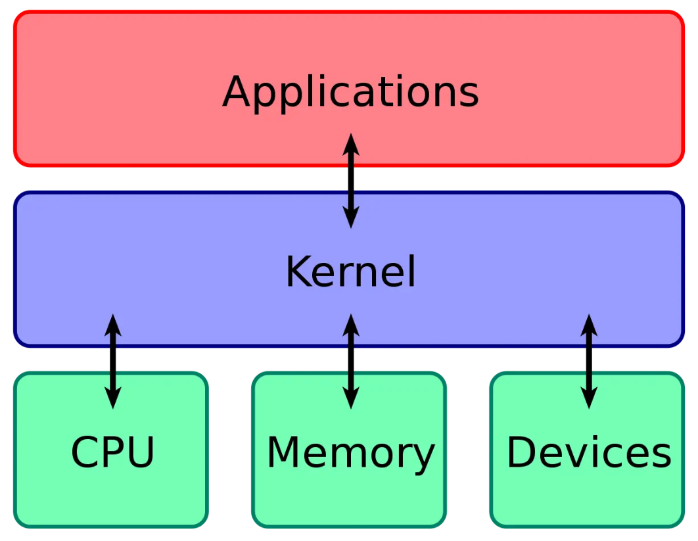
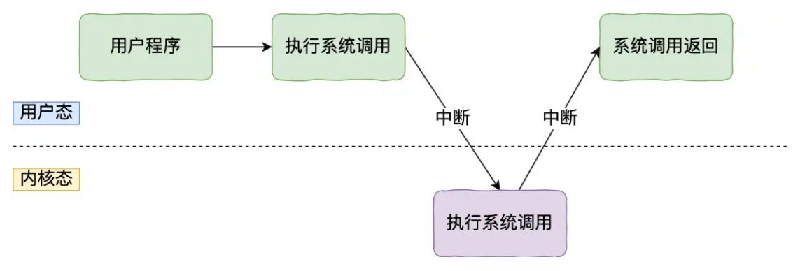
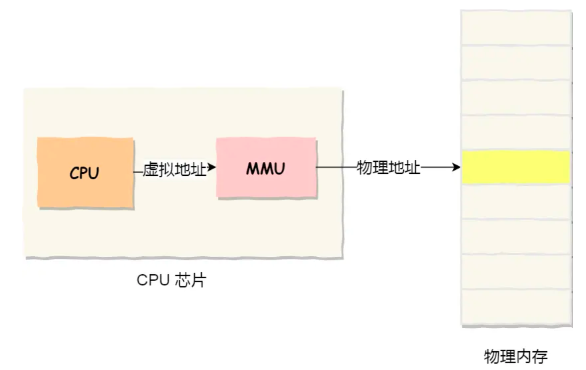
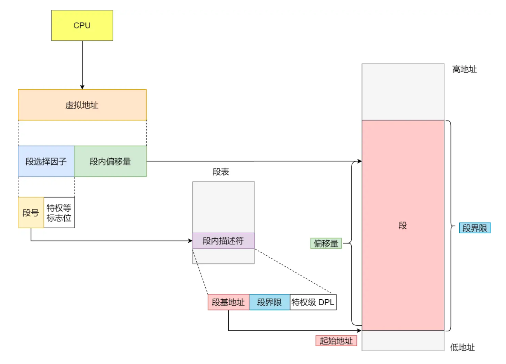
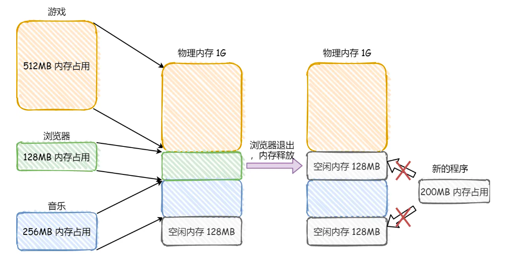
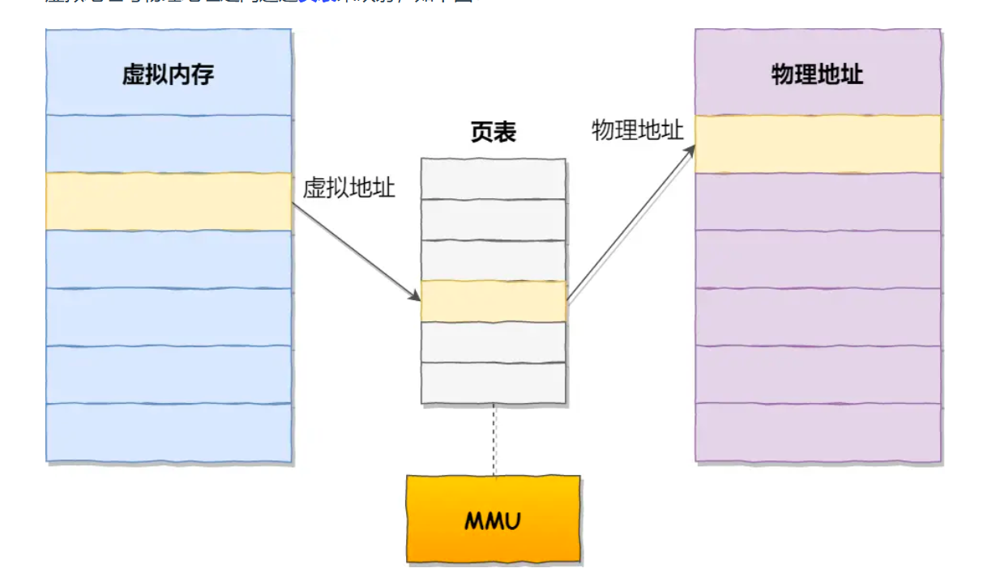

## STL

- vector扩容机制（如何扩容、扩容方式、移动语义、拷贝构造）
- 

###

本质是穷举，可以加上剪枝减少消耗。

从顶部到底部，从左到右，构造树形结构，集合的大小构成树的宽度、递归的深度。

回溯三部曲（返回值及参数、终止条件、遍历过程）




## OS

1. Linux 内核 vs Windows 内核 


`连接应用和硬件设备的桥梁`

四个基本能力：

- 管理进程、线程，决定哪个进程、线程使用 CPU，也就是进程调度的能力;
- 管理内存，决定内存的分配和回收，也就是内存管理的能力;
- 管理硬件设备，为进程与硬件设备之间提供通信能力，也就是硬件通信能力；
- 提供系统调用，如果应用程序要运行更高权限运行的服务，那么就需要有系统调用，它是用户程序与操作系统之间的接口。


内核具有很高的权限，可以控制cpu、内存、硬盘等硬件，而应用程序具有的权限很小，因此大多数操作系统，把内存分成了两个区域:

- 内核空间，这个内存空间只有内核程序可以访问
- 用户空间，这个内存空间专门给应用程序使用;

用户空间的代码只能访问一个局部的内存空间，而内核空间的代码可以访问所有内存空间。因此，当程序使用用户空间时，我们常说该程序在用户态执行，而当程序使内核空间时，程序则在内核态执行。

应用程序如果需要进入内核空间，就需要通过系统调用，下面来看看系统调用的过程:



内核程序执行在内核态，用户程序执行在用户态。当应用程序使用系统调用时，会产生一个中断。发生中断后， CPU 会中断当前在执行的用户程序，转而跳转到中断处理程序，也就是开始执行内核程序。内核处理完后，主动触发中断，把 CPU 执行权限交回给用户程序，回到用户态继续工作。

```
用户态程序执行
       |
       | 调用系统调用函数（如 write）
       |
       v
触发特权指令（如 syscall）
       |
       | -> CPU 从用户态切换到内核态
       |
       v
内核处理系统调用
       |
       | -> 执行系统调用逻辑
       |
       v
内核返回用户态
       |
       | -> CPU 恢复用户态上下文
       |
       v
用户态程序继续执行

```


### 内存管理
2. 虚拟内存

我们可以把进程所使用的地址「隔离」开来，即让操作系统为每个进程分配独立的一套「虚拟地址」，人人都有，大家自己玩自己的地址就行，互不干涉。但是有个前提每个进程都不能访问物理地址，至于虚拟地址最终怎么落到物理内存里，对进程来说是透明的，操作系统已经把这些都安排的明明白白了。


> [!NOTE]
>
> 操作系统会提供一种机制，将不同进程的虚拟地址和不同内存的物理地址映射起来

如果程序要访问虚拟地址的时候，由操作系统转换成不同的物理地址，这样不同的进程运行的时候，写入的是不同的物理地址，这样就不会冲突了。
于是，这里就引出了两种地址的概念:
- 我们程序所使用的内存地址叫做虚拟内存地址(Virtual Memory Address)
- 实际存在硬件里面的空间地址叫物理内存地址(Physical Memory Address)



> [!NOTE]
>
> 操作系统引入了虚拟内存，进程持有的虚拟地址会通过CPU 芯片中的内存管理单元(MMU)的映射关系，来转换变成物理地址，然后再通过物理地址访问内存


操作系统是如何管理虚拟地址与物理地址之间的关系?
- 主要有两种方式，分别是`内存分段`和`内存分页`

3. 内存分段

程序是由若干个逻辑分段组成的，如可由代码分段、数据分段、栈段、堆段组成。不同的段是有不同的属性的，所以就用分段(Segmentation)的形式把这些段分离出来。

> [!NOTE]
>
> 分段机制下，虚拟地址和物理地址是如何映射的?

分段机制下的虚拟地址由两部分组成，**段选择因子**和**段内偏移量**



分段的办法很好，解决了程序本身不需要关心具体的物理内存地址的问题，但它也有一些不足之处:
- 内存碎片
- 内存交换效率低

4. 内存碎片 
> [!NOTE]
>
> 我们先来看看，分段为什么会产生内存碎片的问题?



内存碎片主要分为，**内部内存碎片**和**外部内存碎片**。

解决「外部内存碎片」的问题就是**内存交换**

- 可以把音乐程序占用的那 256MB 内存写到硬盘上，然后再从硬盘上读回来到内存里。不过再读回的时候，我们不能装载回原来的位置，而是紧紧跟着那已经被占用了的512MB 内存后面。这样就能空缺出连续的 256MB 空间，于是新的 200MB 程序就可以装载进来。

> [!NOTE]
>
> 再来看看，分段为什么会导致内存交换效率低的问题?

对于多进程的系统来说，用分段的方式，外部内存碎片是很容易产生的，产生了外部内存碎片，那不得不重新 swap 内存区域，这个过程会产生性能瓶颈。
因为硬盘的访问速度要比内存慢太多了，每一次内存交换，我们都需要把一大段连续的内存数据写到硬盘上。

所以，**如果内存交换的时候，交换的是一个占内存空间很大的程序，这样整个机器都会显得卡顿**。

为了解决内存分段的「外部内存碎片和内存交换效率低」的问题，就出现了**内存分页**。


5. 内存分页

分段的好处就是能产生连续的内存空间，但是会出现「外部内存碎片和内存交换的空间太大」的问题。

要解决这些问题，那么就要想出能少出现一些内存碎片的办法。另外，当需要进行内存交换的时候，让需要交换写入或者从磁盘装载的数据更少一点，这样就可以解决问题了。这个办法，也就是**内存分页(Paging)**

**分页是把整个虚拟和物理内存空间切成一段段固定尺寸的大小**。这样一个连续并且尺寸固定的内存空间我们叫页(Page)。在 Linux下，每一页的大小为 4KB

虚拟地址与物理地址之间通过页表来映射，如下图：



页表是存储在内存里的，**内存管理单元(MMU)**就做将虚拟内存地址转换成物理地址的工作。

6. 段页式内存管理


7. malloc 是如何分配内存的？


8. new 是如何分配内存的？

> [!NOTE]
>
> for循环可以理解是横向遍历，backtracking（递归）就是纵向遍历。


分层分阶

Markdown 是一种轻量级且易于使用的语法，用于为您的写作设计风格。

### 标题

文章内容较多时，可以用标题分段：

```markdown
# 标题 1

## 标题 2

## 大标题

### 小标题
```

标题预览会打乱文章的结构，所以在此不展示。

### 粗斜体

```markdown
_斜体文本_

**粗体文本**

**_粗斜体文本_**
```

预览：

_斜体文本_

**粗体文本**

**_粗斜体文本_**

### 链接

```markdown
文字链接 [链接名称](http://链接网址)
```

预览：

文字链接 [链接名称](http://链接网址)

### 行内代码

```markdown
这是一条 `单行代码`
```

预览：

这是一条 `行内代码`

### 代码块

````markdown
```js
// calculate fibonacci
function fibonacci(n) {
  if (n <= 1) return 1
  return fibonacci(n - 1) + fibonacci(n - 2)
}
```
````

预览：

```js
// calculate fibonacci
function fibonacci(n) {
  if (n <= 1) return 1
  return fibonacci(n - 1) + fibonacci(n - 2)
}
```

当前使用 shiki 作为代码高亮插件，支持的语言请参考 [shiki / languages](https://shiki.matsu.io/languages.html)。

### 行内公式

```markdown
这是一条行内公式 $e^{i\pi} + 1 = 0$
```

预览：

这是一条行内公式 $e^{i\pi} + 1 = 0$

### 公式块

```markdown
$$
\hat{f}(\xi) = \int_{-\infty}^{\infty} f(x) e^{-2\pi i x \xi} \, dx
$$
```

预览：

$$
\hat{f}(\xi) = \int_{-\infty}^{\infty} f(x) e^{-2\pi i x \xi} \, dx
$$

当前使用 KaTeX 作为数学公式插件，支持的语法请参考 [KaTeX Supported Functions](https://katex.org/docs/supported.html)。

#### 图片

```markdown

```

预览：


#### 删除线

```markdown
~~删除线~~
```

预览：

~~删除线~~

### 列表

普通无序列表

```markdown
- 1
- 2
- 3
```

预览：

- 1
- 2
- 3

普通有序列表

```markdown
1. GPT-4
2. Claude Opus
3. LLaMa
```

预览：

1. GPT-4
2. Claude Opus
3. LLaMa

列表里可以继续嵌套语法

### 引用

```markdown
> 枪响，雷鸣，剑起。繁花血景。
```

预览：

> 枪响，雷鸣，剑起。繁花血景。

引用里也可以继续嵌套语法。

### 换行

markdown 分段落是需要空一行的。

```markdown
如果不空行
就会在一段

第一段

第二段
```

预览：

如果不空行
就会在一段

第一段

第二段

### 分隔符

如果你有写分割线的习惯，可以新起一行输入三个减号`---` 或者星号 `***`。当前后都有段落时，请空出一行：

```markdown
---
```

预览：

---

## 高级技巧

### 行内 HTML 元素

目前只支持部分段内 HTML 元素效果，包括 `<kdb> <b> <i> <em> <sup> <sub> <br>` ，如

#### 键位显示

```markdown
使用 <kbd>Ctrl</kbd> + <kbd>Alt</kbd> + <kbd>Del</kbd> 重启电脑
```

预览：

使用 <kbd>Ctrl</kbd> + <kbd>Alt</kbd> + <kbd>Del</kbd> 重启电脑

#### 粗斜体

```markdown
<b> Markdown 在此处同样适用，如 _加粗_ </b>
```

预览：

<b> Markdown 在此处同样适用，如 _加粗_ </b>

### 其他 HTML 写法

#### 折叠块

```markdown
<details><summary>点击展开</summary>它被隐藏了</details>
```

预览：

<details><summary>点击展开</summary>它被隐藏了</details>

### 表格

```markdown
| 表头1 | 表头2 |
| ----- | ----- |
| 内容1 | 内容2 |
```

预览：

| 表头1 | 表头2 |
| ----- | ----- |
| 内容1 | 内容2 |

### 注释

```markdown
在引用的地方使用 [^注释] 来添加注释。

然后在文档的结尾，添加注释的内容（会默认于文章结尾渲染之）。

[^注释]: 这里是注释的内容
```

预览：

在引用的地方使用 [^注释] 来添加注释。

然后在文档的结尾，添加注释的内容（会默认于文章结尾渲染之）。

[^注释]: 这里是注释的内容

### To-Do 列表

```markdown
- [ ] 未完成的任务
- [x] 已完成的任务
```

预览：

- [ ] 未完成的任务
- [x] 已完成的任务

### 特别引用块

```markdown
> [!NOTE]
> 在浏览内容时，用户也应该知道的有用信息。

> [!TIP]
> 可以更好或更容易地完成事情的有用建议。

> [!IMPORTANT]
> 用户需要知道的关键信息。

> [!WARNING]
> 需要用户立即关注以避免问题的紧急信息。

> [!CAUTION]
> 就某些行为的风险或负面结果提供建议。
```

预览：

> [!NOTE]
> 在浏览内容时，用户也应该知道的有用信息。

> [!TIP]
> 可以更好或更容易地完成事情的有用建议。

> [!IMPORTANT]
> 用户需要知道的关键信息。

> [!WARNING]
> 需要用户立即关注以避免问题的紧急信息。

> [!CAUTION]
> 就某些行为的风险或负面结果提供建议。

### 符号转义

如果你的描述中需要用到 markdown 的符号，比如 \_ # \* 等，但又不想它被转义，这时候可以在这些符号前加反斜杠，如 `\_` `\#` `\*` 进行避免。

```markdown
\_不想这里的文本变斜体\_

\*\*不想这里的文本被加粗\*\*
```

预览：

\_不想这里的文本变斜体\_

\*\*不想这里的文本被加粗\*\*

---

## 内嵌 Astro 组件

源代码位于 `src/components` 目录下，一般不用于写作，而是用于页面的客制化。

你可以仿照现有组件的写法，自行添加新的组件。
