## 问题背景

[astro-theme-pure](https://github.com/cworld1/astro-theme-pure)

课题室工具现有的BIM实例化加载技术路线：revit->RISCRvt->glb->3DTiles->HISM加载

在对Revit模型进行上述技术路线实现，发现实例化后的部分模型构件无法正确显示

## 问题分析

1. 首先确认问题在Revit源数据？在revit->RISCRvt？在RISCRvt->glb？在glb->3DTiels？
排查：通过加载glb文件发现，glb已经出现了问题，无法正确显示，排除后续技术路线问题。

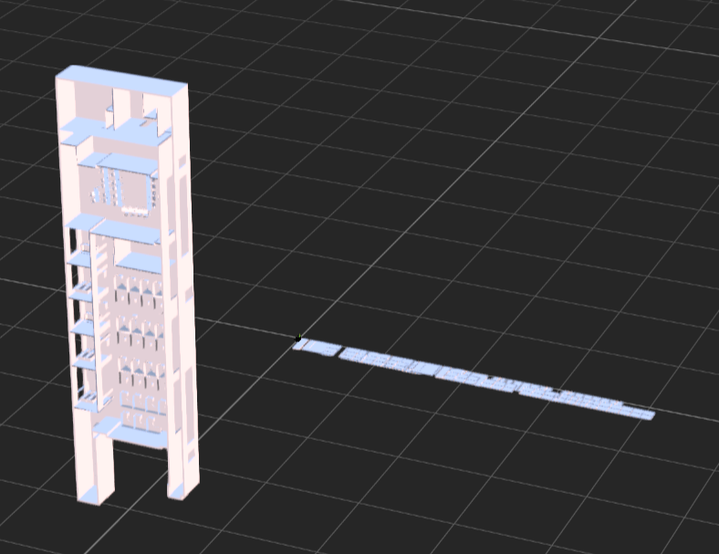

2. 确认问题出在Revit源数据？
排查：使用datasmith插件加载Revit源模型到UE中发现，模型可以正常显示，排除Revit源数据问题

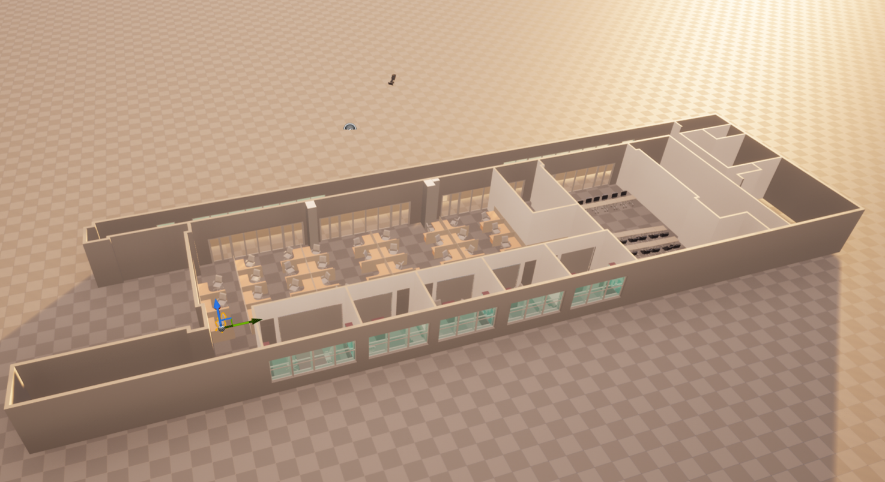

3. 确认问题出在RISCRvt->glb？
排查：在RISCRvt->glb中选择不使用实例化技术，发现模型可以正常显示，排除RISCRvt问题，问题出在实例化技术上。

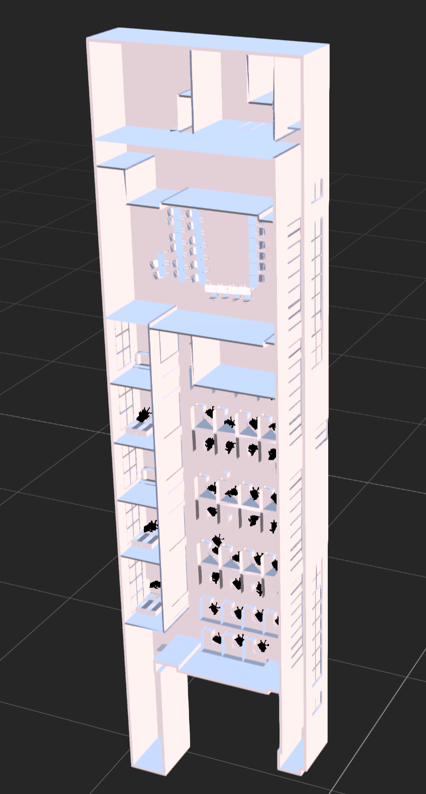

4. 模型由数百个构件组成，构件类型分为实例化构件、非实例化构件。非实例化构件正常显示，部分实例化构件可以正常显示，而部分实例化构件无法正常显示，原因？
排查：不使用实例化技术与使用实例化技术进行对比，可以看到，无法正常实例化加载显示的构件在于门窗等嵌套结构。


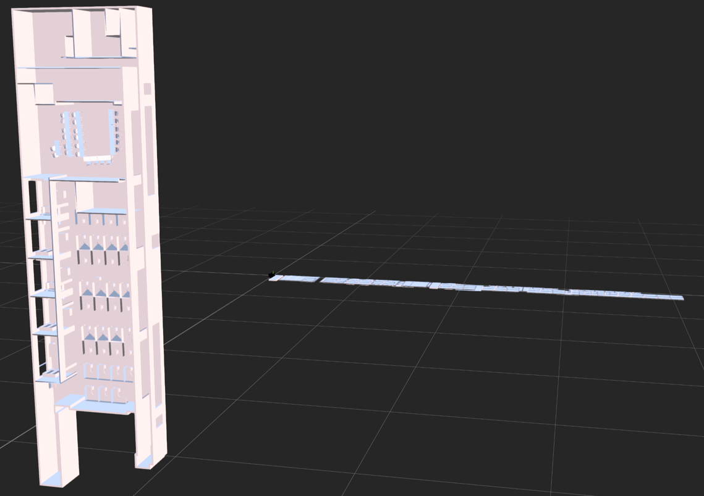
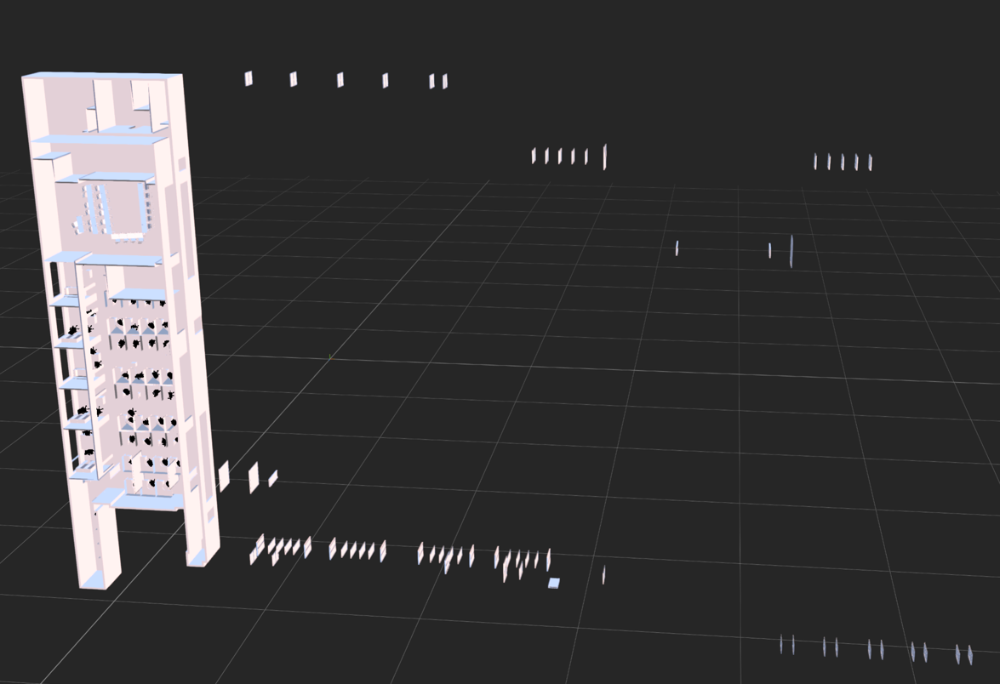

5. 如何查看具体的构件名称及transform？
解决：使用[glb查看网址](https://remixicon.com/)点击查看有问题的构件ID，然后根据构件ID使用`gltf-vscode`插件查找gltf源数据，发现门窗等嵌套结构的构件transform信息与非实例化构件的transform信息不一致，导致实例化失败。

6. 查看具体transform坐标信息
解决：由于转换出来的数据是`glb`格式,无法直接使用`gltf-vscode`插件查找gltf源数据，于是先编写`glb2gltf转换工具`[(https://github.com/271586852/glb2gltf)](https://github.com/271586852/glb2gltf)，导出成`gltf和bin文件`，再用`gltf-vscode`查看构件的具体信息，此处实例化构件信息存成了`buffer缓冲区`，而缓冲区信息无法直接查看，编写`buffer读取代码`,将要查看的缓冲区信息进行读取解析。

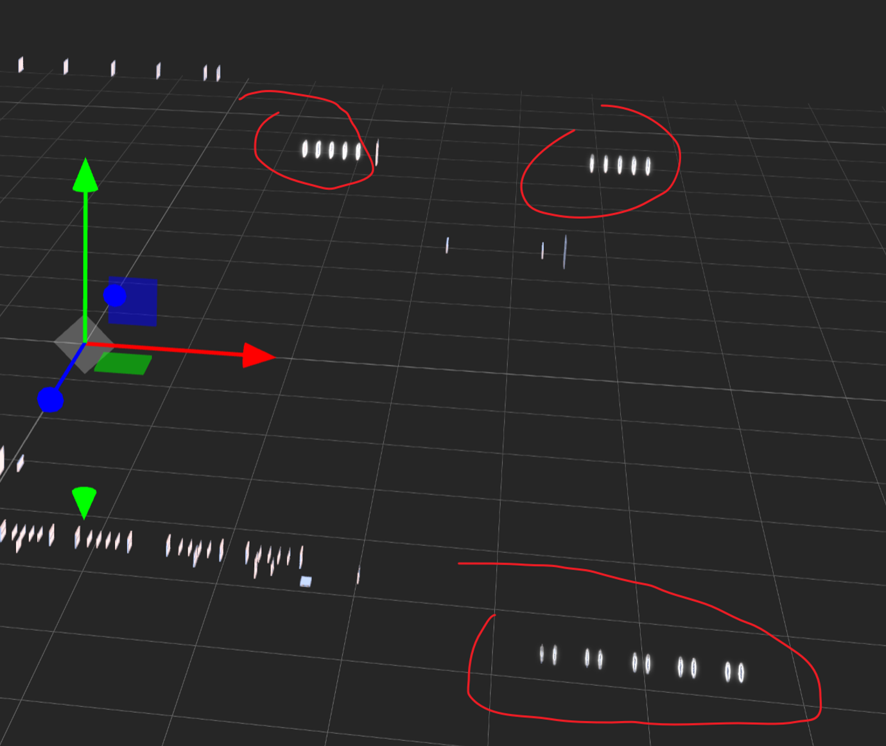

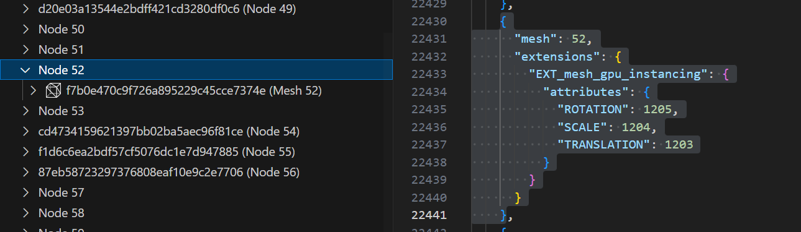

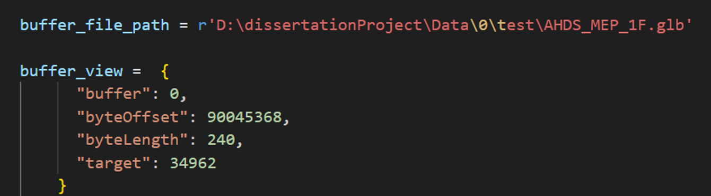

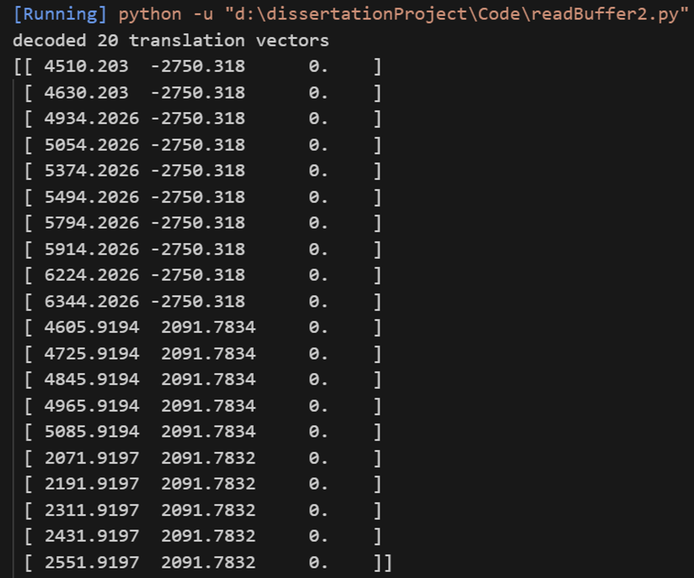

7. 源码Debug与修改
解决：找到源码中关于实例化的部分，逐行调试，最终定位实例化节点更新的核心代码如下：

```c++
void UpdateChildNodeTransform(Model& model, Node& node)
{
	// 获取当前节点的变换
	FTransform nodeTransform = GetNodeTransForm(node);

	// 遍历子节点并递归更新
	for (int i = 0; i < node.children.size(); ++i)
	{
		int childrenIndex = node.children[i];
		Node& currentChild = model.nodes[childrenIndex];
		FTransform childTransform = GetNodeTransForm(currentChild);
		FTransform resultTrans = nodeTransform  * childTransform;
		SetNodeTransForm(currentChild, resultTrans);

		UpdateChildNodeTransform(model, currentChild);
	}

	// 如果没有子节点，当前节点的变换仍然可以被计算（如果需要）
	SetNodeTransForm(node, nodeTransform);
}
```

根据上一步找到的的构件ID及transform信息，查看`UpdateChildNodeTransform`函数的执行流程，发现`nodeTransform`和`childTransform`的计算出的`resultTransform`矩阵有问题，进行分析。

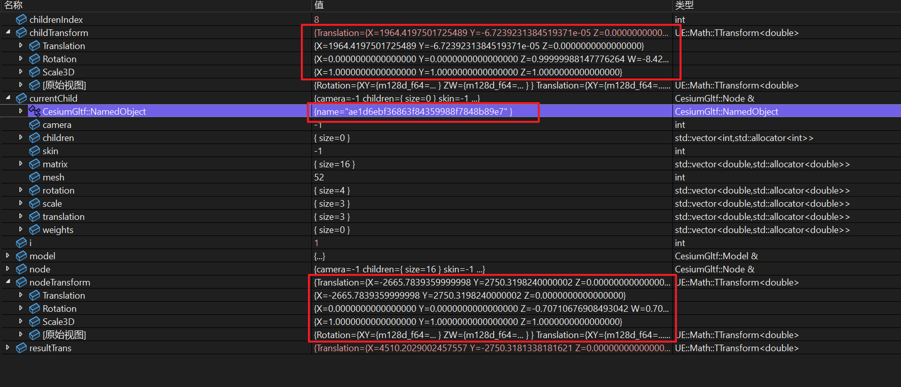


此处的计算方式是`父矩阵乘子矩阵`，而在Revit中，对于嵌套构件，需要的是`子矩阵乘父矩阵`，导致坐标变换结果失败。

对其中的`FTransform resultTrans = nodeTransform * childTransform;`进行修改，修改后代码如下：

```c++
void UpdateChildNodeTransform(Model& model, Node& node)
{
	// 获取当前节点的变换
	FTransform nodeTransform = GetNodeTransForm(node);

	// 遍历子节点并递归更新
	for (int i = 0; i < node.children.size(); ++i)
	{
		int childrenIndex = node.children[i];
		Node& currentChild = model.nodes[childrenIndex];
		FTransform childTransform = GetNodeTransForm(currentChild);
		// 计算子节点的变换，注意是 子矩阵乘父矩阵
		FTransform resultTrans = childTransform * nodeTransform;

		SetNodeTransForm(currentChild, resultTrans);

		UpdateChildNodeTransform(model, currentChild);
	}

	// 如果没有子节点，当前节点的变换仍然可以被计算（如果需要）
	SetNodeTransForm(node, nodeTransform);
}
```

修改后，重新导出`glb`文件，并且转换为3DTiles组织形式并放到UE中进行加载，实例化成功。

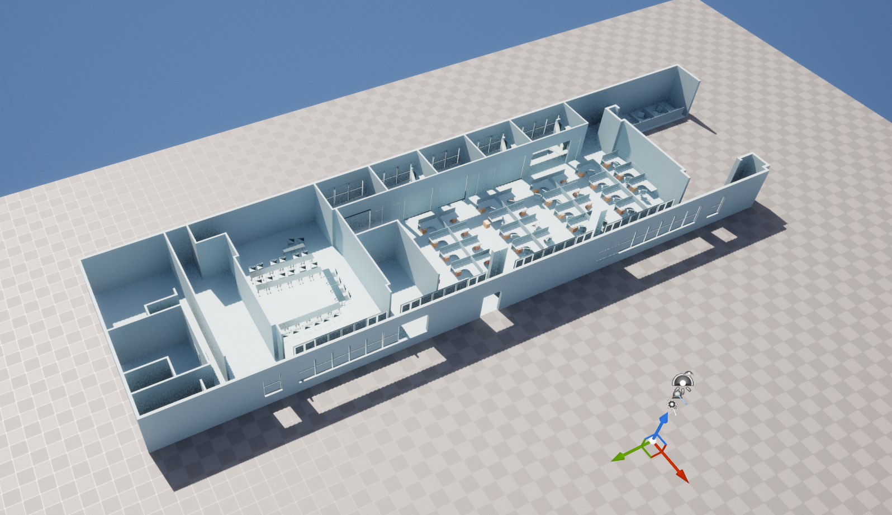

## 参考工具及文档

- [glb查看网址](https://remixicon.com/)
- [gltf-vscode](https://github.com/AnalyticalGraphicsInc/gltf-vscode/tree/master)
- [datasmith导入](https://dev.epicgames.com/documentation/zh-cn/unreal-engine/importing-datasmith-content-into-unreal-engine)
- [gltf2.0解析](https://zhuanlan.zhihu.com/p/654304512)
