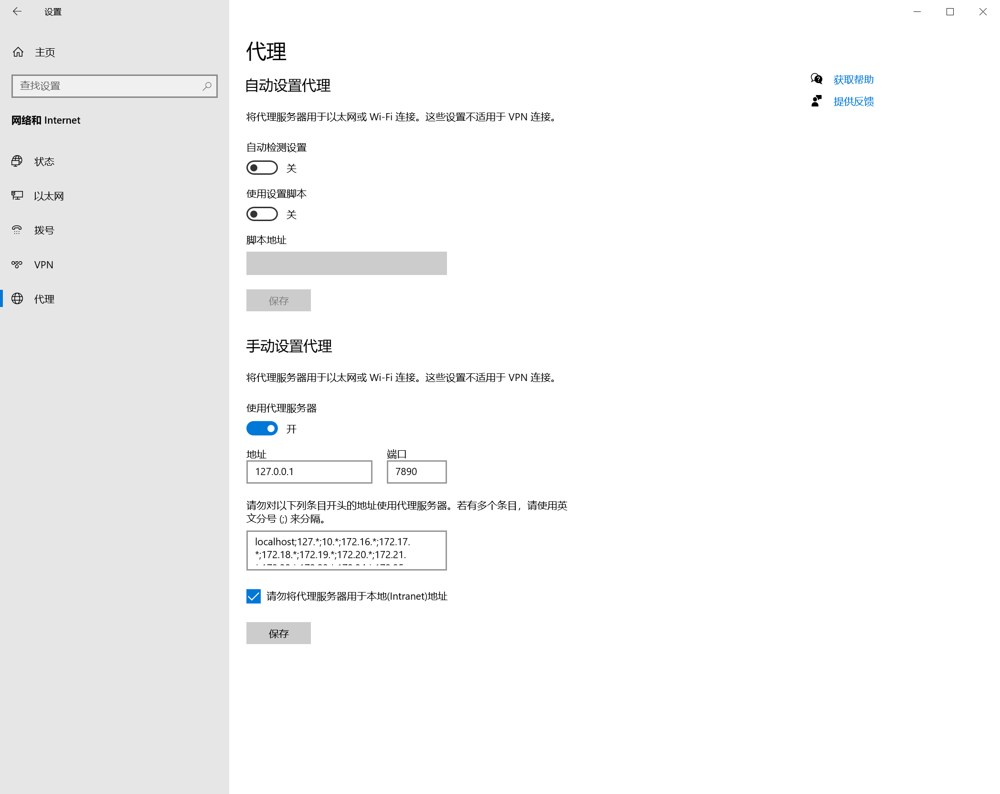

## 问题

如图所示：



## 原因

多次提交后，出现了错误，需要回滚到上次正常提交的节点，以撤回中间的提交。

## 解决

由于中间有多次重复的提交信息，采用`git reset`命令进行回滚，回到上次正常提交的节点，并且根据报错修改blog。

```bash
git reset --soft HEAD~3
```

## 扩展

- `git reset`：用于重置当前分支的指针，包括工作目录和暂存区。
- `git revert`：用于撤销指定的提交，同时保留撤销的提交记录。
- `git rebase`：用于将当前分支的提交重新应用到另一个分支上。
- `git merge`：用于将两个分支的提交合并到一个分支上。

> [!NOTE]
>
> `git reset`和`git revert`的区别在于，`git reset`可以删除指定提交之后的提交历史，包括提交信息。而`git revert`则是创建一个新的提交，用于撤销指定的提交。