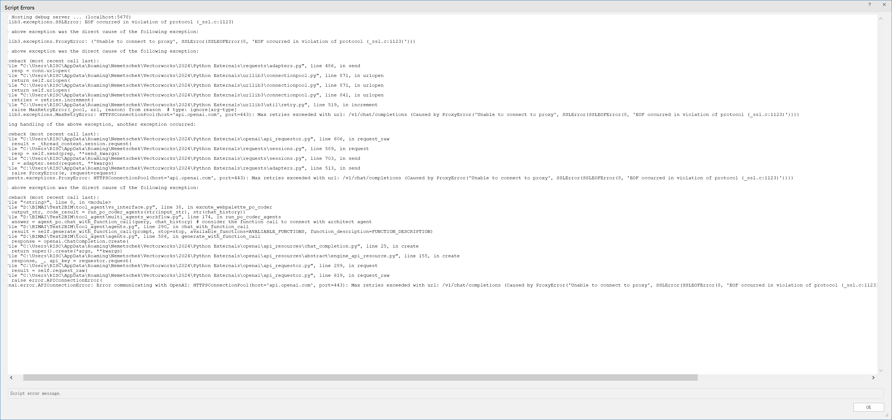
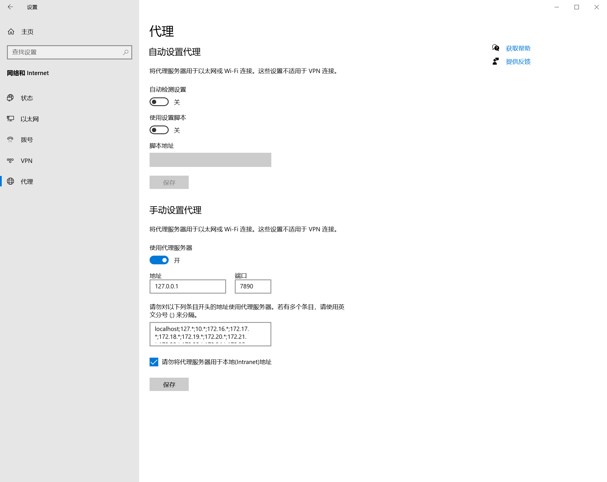

## 前言

项目中需要用到UBT和UHT工具进行UE的工程编译，有必要对这两个工具作解构，故此写下本文。

要探究UBT与UHT的运行流程，从UBT工程调试着手，打开UE源码，将UBT工程设为启动项，设置命令行参数参考命令
`newUBTTest Win64 Development -Project="D:\dev\UBTTest\newUBTTest\newUBTTest.uproject" -Modules=Engine -WaitMutex -FromMsBuild`

> [!NOTE]
>
> 此处`newUBTTest.uproject`为使用UE编辑器创建的模板工程。

## 入口

开始调试，入口函数`UnrealBuildTool.cs::Main`,进入入口函数后，进行了多个任务的创建


## 部署模式

> [!NOTE]
>
> 对应 `astro.config.ts` 中的 `export default defineConfig` 配置项。

如果你采用 Vercel 部署，你无需修改。

如果你采用 Node.js 本地部署，你需要依照 `astro.config.ts` 中的注释，修改

```ts
import vercel from '@astrojs/vercel/serverless'
...
export default defineConfig({
  adapter: vercel({
    webAnalytics: {
      enabled: true
    }
  }),
  ...
})
```

为

```ts
import node from '@astrojs/node'
...
export default defineConfig({
  adapter: node({
    mode: 'standalone'
  }),
  ...
})
```


1、代理问题
调用openai出现代理问题。




2、连接超时问题